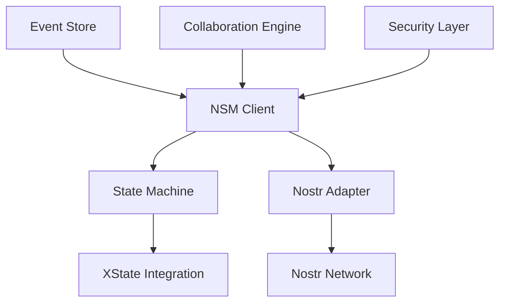

## What is NSM Framework?

NSM (Nostr State Machine) Framework is a powerful toolkit for building **deterministic, multi-user applications** on the Nostr protocol. By combining state machines with Nostr's decentralized messaging, NSM enables developers to create collaborative applications that are both predictable and resilient.

<CardGroup cols={2}>
  <Card
    title="Deterministic State"
    icon="gear"
    href="/guide/state-machines"
  >
    Build applications with predictable state transitions using XState integration
  </Card>
  <Card
    title="Collaborative by Design"
    icon="users"
    href="/guide/collaborative-state"
  >
    Enable real-time collaboration between multiple users seamlessly
  </Card>
  <Card
    title="Nostr Integration"
    icon="broadcast-tower"
    href="/guide/nostr-integration"
  >
    Leverage Nostr's decentralized network for messaging and data persistence
  </Card>
  <Card
    title="Event Sourcing"
    icon="clock-rotate-left"
    href="/guide/event-sourcing"
  >
    Track all state changes with complete audit trails and time-travel debugging
  </Card>
</CardGroup>

## Key Features

- **🎯 Deterministic**: Predictable state transitions with XState integration
- **🤝 Collaborative**: Real-time multi-user state synchronization
- **🌐 Decentralized**: Built on Nostr's censorship-resistant network
- **📝 Event Sourced**: Complete audit trails and time-travel debugging
- **⚡ Performance**: Optimized for low-latency real-time applications
- **🔒 Secure**: Built-in cryptographic verification and access control
- **🧪 Testable**: Comprehensive testing utilities and deterministic behavior
- **📦 TypeScript**: Full type safety and excellent developer experience

## Use Cases

NSM Framework is perfect for building:

- **Collaborative Editors** - Real-time document editing with conflict resolution
- **Chat Applications** - Decentralized messaging with rich state management
- **Task Management** - Team productivity tools with real-time updates
- **Gaming Applications** - Turn-based or real-time multiplayer games
- **Social Networks** - Decentralized social platforms with complex interactions
- **Financial Applications** - Transparent, auditable financial state machines

## Getting Started

<CardGroup cols={2}>
  <Card
    title="Quick Start"
    icon="rocket"
    href="/quickstart"
  >
    Get up and running with NSM in under 5 minutes
  </Card>
  <Card
    title="Installation"
    icon="download"
    href="/installation"
  >
    Install NSM Framework in your project
  </Card>
  <Card
    title="Examples"
    icon="code"
    href="/examples"
  >
    Explore example applications and tutorials
  </Card>
  <Card
    title="API Reference"
    icon="book"
    href="/api"
  >
    Dive deep into the NSM API documentation
  </Card>
</CardGroup>

## Architecture Overview

NSM Framework consists of several key components:

### Core Components

1. **NSM Client** - Main entry point for applications
2. **State Machine** - Deterministic state management with XState
3. **Nostr Adapter** - Integration with Nostr protocol
4. **Event Store** - Persistent event storage and replay
5. **Collaboration Engine** - Multi-user state synchronization
6. **Security Layer** - Cryptographic verification and access control

## Community & Support

- **GitHub**: [github.com/soveng/nsm](https://github.com/soveng/nsm)
- **Twitter**: [@nsmframework](https://twitter.com/nsmframework)
- **Discord**: [Join our community](https://discord.gg/nsmframework)
- **Documentation**: You're reading it! 📖

Ready to build your next collaborative application? [Get started now](/quickstart) or explore our [examples](/examples).