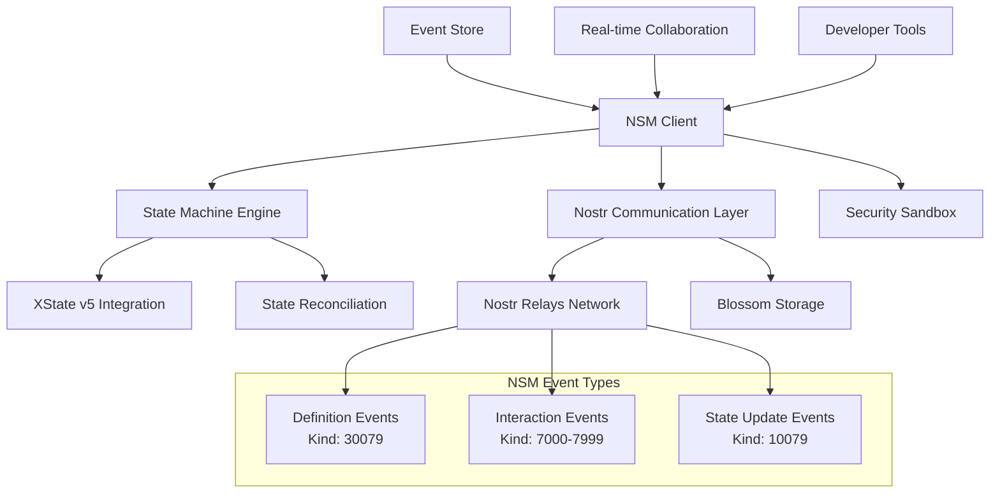

## What is NSM Framework?

NSM (Nostr State Machine) Framework is a powerful toolkit for building **deterministic, multi-user applications** on the Nostr protocol. By combining state machines with Nostr's decentralized messaging, NSM enables developers to create collaborative applications that are both predictable and resilient.

### Key Concepts

**Nostr State Machines** combine three powerful paradigms:

1. **State Machines**: Predictable, deterministic state transitions using XState v5
2. **Nostr Protocol**: Decentralized, censorship-resistant communication layer
3. **Event Sourcing**: Complete audit trail of all state changes over time

This unique combination enables applications where multiple users can collaborate in real-time while maintaining data integrity and consistency across a decentralized network.

### Why NSM Framework?

Traditional collaborative applications face several challenges:

- **Centralized servers** create single points of failure and censorship risk
- **Inconsistent state** between users leads to conflicts and data loss
- **Complex synchronization** logic is hard to implement and maintain
- **Poor offline experience** when network connectivity is unreliable

NSM Framework solves these problems by:

- **Decentralizing communication** through Nostr relays
- **Ensuring deterministic behavior** with state machines
- **Providing conflict resolution** through event ordering and canonical state
- **Enabling offline-first design** with eventual consistency

<CardGroup cols={2}>
  <Card
    title="Deterministic State"
    icon="gear"
    href="/guide/state-machines"
  >
    Build applications with predictable state transitions using XState integration
  </Card>
  <Card
    title="Collaborative by Design"
    icon="users"
    href="/guide/collaborative-state"
  >
    Enable real-time collaboration between multiple users seamlessly
  </Card>
  <Card
    title="Nostr Integration"
    icon="broadcast-tower"
    href="/guide/nostr-integration"
  >
    Leverage Nostr's decentralized network for messaging and data persistence
  </Card>
  <Card
    title="Event Sourcing"
    icon="clock-rotate-left"
    href="/guide/event-sourcing"
  >
    Track all state changes with complete audit trails and time-travel debugging
  </Card>
</CardGroup>

## Key Features

- **🎯 Deterministic**: Predictable state transitions with XState integration
- **🤝 Collaborative**: Real-time multi-user state synchronization
- **🌐 Decentralized**: Built on Nostr's censorship-resistant network
- **📝 Event Sourced**: Complete audit trails and time-travel debugging
- **⚡ Performance**: Optimized for low-latency real-time applications
- **🔒 Secure**: Built-in cryptographic verification and access control
- **🧪 Testable**: Comprehensive testing utilities and deterministic behavior
- **📦 TypeScript**: Full type safety and excellent developer experience

## Use Cases

NSM Framework is perfect for building:

- **Collaborative Editors** - Real-time document editing with conflict resolution
- **Chat Applications** - Decentralized messaging with rich state management
- **Task Management** - Team productivity tools with real-time updates
- **Gaming Applications** - Turn-based or real-time multiplayer games
- **Social Networks** - Decentralized social platforms with complex interactions
- **Financial Applications** - Transparent, auditable financial state machines

## Getting Started

<CardGroup cols={2}>
  <Card
    title="Quick Start"
    icon="rocket"
    href="/quickstart"
  >
    Get up and running with NSM in under 5 minutes
  </Card>
  <Card
    title="Installation"
    icon="download"
    href="/installation"
  >
    Install NSM Framework in your project
  </Card>
  <Card
    title="Examples"
    icon="code"
    href="/examples"
  >
    Explore example applications and tutorials
  </Card>
  <Card
    title="API Reference"
    icon="book"
    href="/api"
  >
    Dive deep into the NSM API documentation
  </Card>
</CardGroup>

## Architecture Overview

NSM Framework consists of several key components working together to enable decentralized, collaborative applications:

### Core Components

1. **NSM Client** - Main entry point providing high-level API for building applications
   - Application discovery and loading
   - Event publishing and subscription
   - State management and synchronization

2. **State Machine Engine** - Deterministic state management with sandboxed execution
   - XState v5 integration for state machine definition and interpretation
   - Secure sandbox for executing untrusted state machine code
   - Optimistic updates with conflict resolution

3. **Nostr Communication Layer** - Integration with Nostr protocol and Blossom storage
   - NDK-based Nostr client with relay management
   - Blossom integration for large asset storage (state machine code, media files)
   - Cryptographic verification and signature handling

4. **Security Sandbox** - Isolated execution environment for untrusted code
   - Web Worker-based isolation
   - Resource constraints and timeout management
   - Code injection prevention and validation

5. **Event Store** - Persistent event storage with replay capabilities
   - Complete audit trail of all state changes
   - Time-travel debugging and state reconstruction
   - Event filtering and subscription management

6. **Real-time Collaboration Engine** - Multi-user state synchronization
   - Deterministic conflict resolution
   - User presence and cursor tracking
   - Session management and participant coordination

### NSM Protocol Specification

NSM Framework uses three specialized Nostr event kinds:

- **Kind 30079**: NSM Definition Events - Define state machine applications with metadata, initial state, and interaction schemas
- **Kind 7000-7999**: NSM Interaction Events - User actions and state machine inputs with application addressing
- **Kind 10079**: NSM State Update Events - Canonical state snapshots for synchronization and recovery

Each event type includes comprehensive validation, cryptographic verification, and integration with existing Nostr infrastructure.

## Community & Support

- **GitHub**: [github.com/soveng/nsm](https://github.com/soveng/nsm)
- **Twitter**: [@nsmframework](https://twitter.com/nsmframework)
- **Discord**: [Join our community](https://discord.gg/nsmframework)
- **Documentation**: You're reading it! 📖

Ready to build your next collaborative application? [Get started now](/quickstart) or explore our [examples](/examples).