# NSM Architecture Overview

This document provides a comprehensive architectural overview of the Nostr State Machine (NSM) protocol, its components, and how they interact to create decentralized, collaborative applications.

## System Architecture

### Core Components

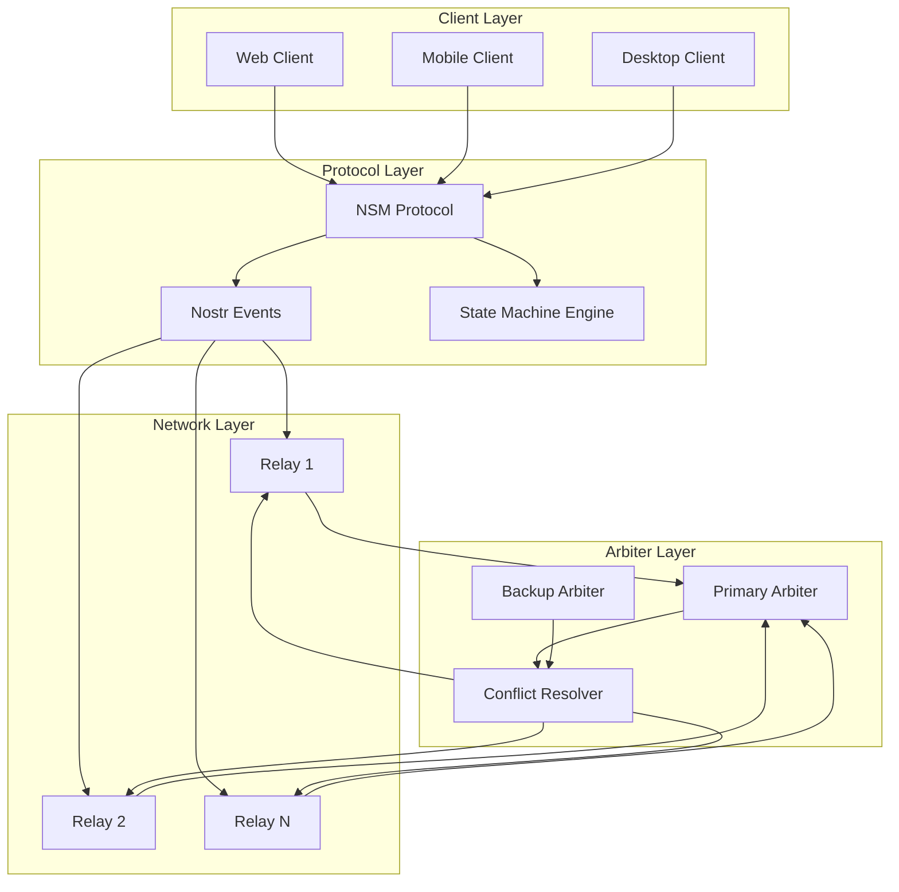

### Component Responsibilities

#### 1. Client Layer
- **User Interface**: Renders application UI and handles user interactions
- **State Management**: Maintains local application state
- **Event Creation**: Generates NSM events from user actions
- **Synchronization**: Syncs local state with network state

#### 2. Protocol Layer
- **Event Validation**: Validates all NSM events against schemas
- **State Transitions**: Executes state machine transitions
- **Cryptographic Operations**: Signs and verifies events
- **Schema Management**: Manages application schemas

#### 3. Network Layer
- **Event Distribution**: Broadcasts events to participants
- **Subscription Management**: Handles real-time subscriptions
- **Data Persistence**: Stores events for retrieval
- **Geographic Distribution**: Provides global availability

#### 4. Arbiter Layer
- **Conflict Resolution**: Resolves concurrent state modifications
- **State Authority**: Maintains canonical application state
- **Event Ordering**: Ensures correct event processing order
- **State Publication**: Publishes authoritative state updates

## Data Flow Architecture

### Event Lifecycle

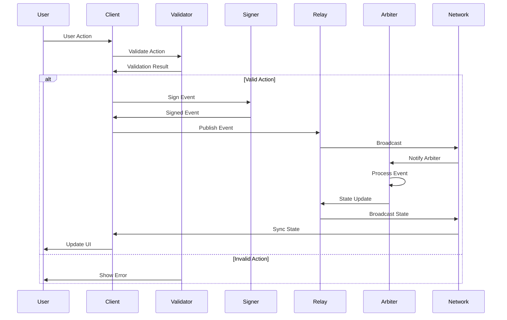

### State Synchronization Flow

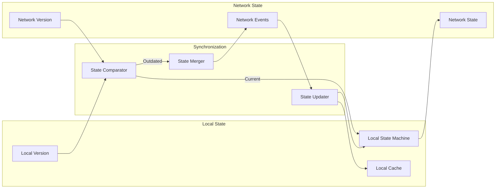

## Event Architecture

### Event Type Hierarchy

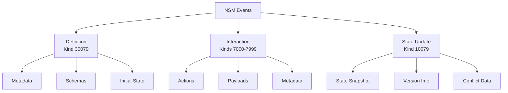

### Event Processing Pipeline

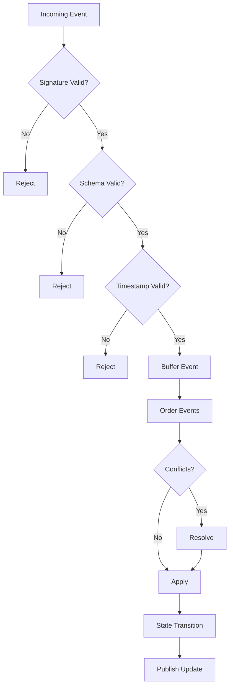

## State Machine Architecture

### State Machine Components

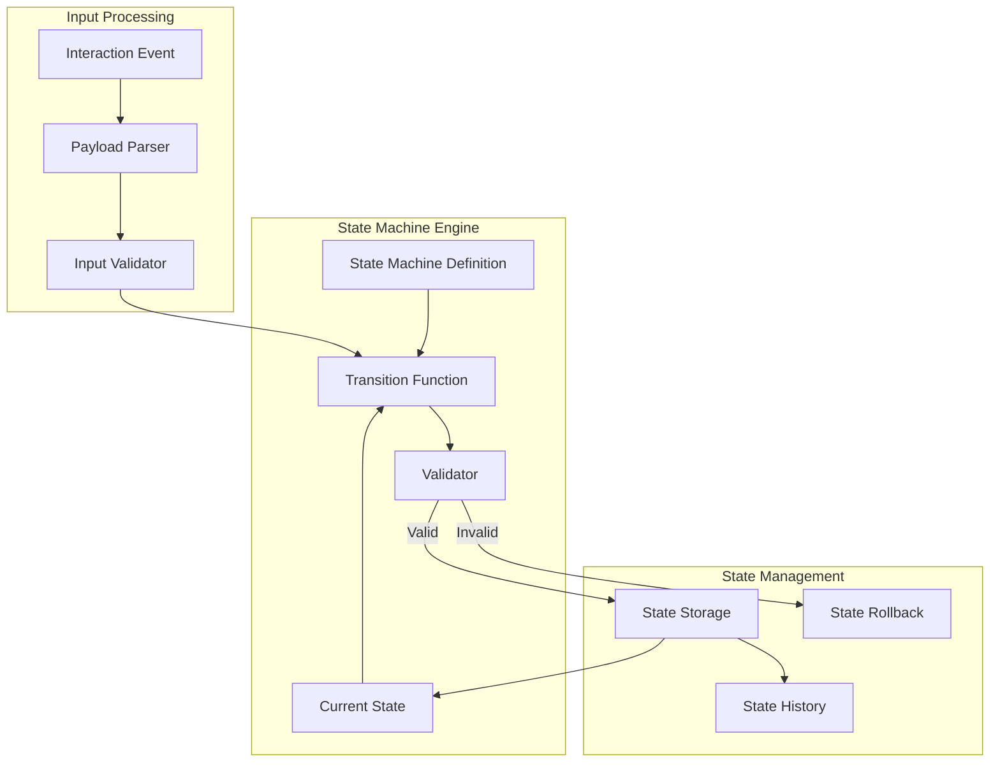

### Transition Validation

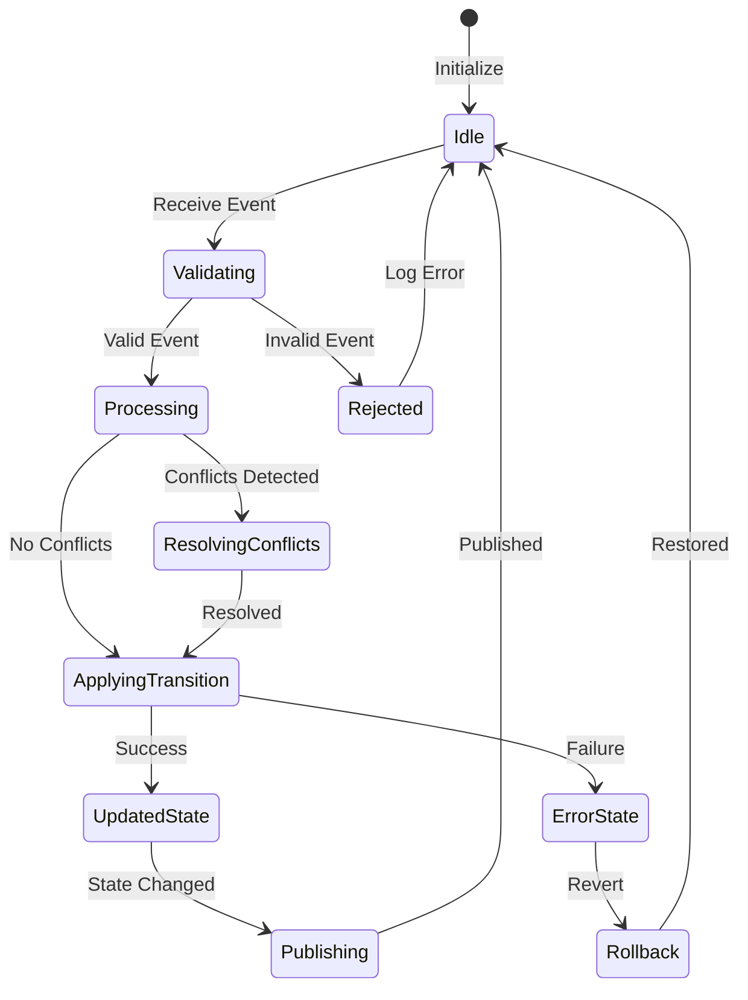

## Conflict Resolution Architecture

### Resolution Strategy Selection

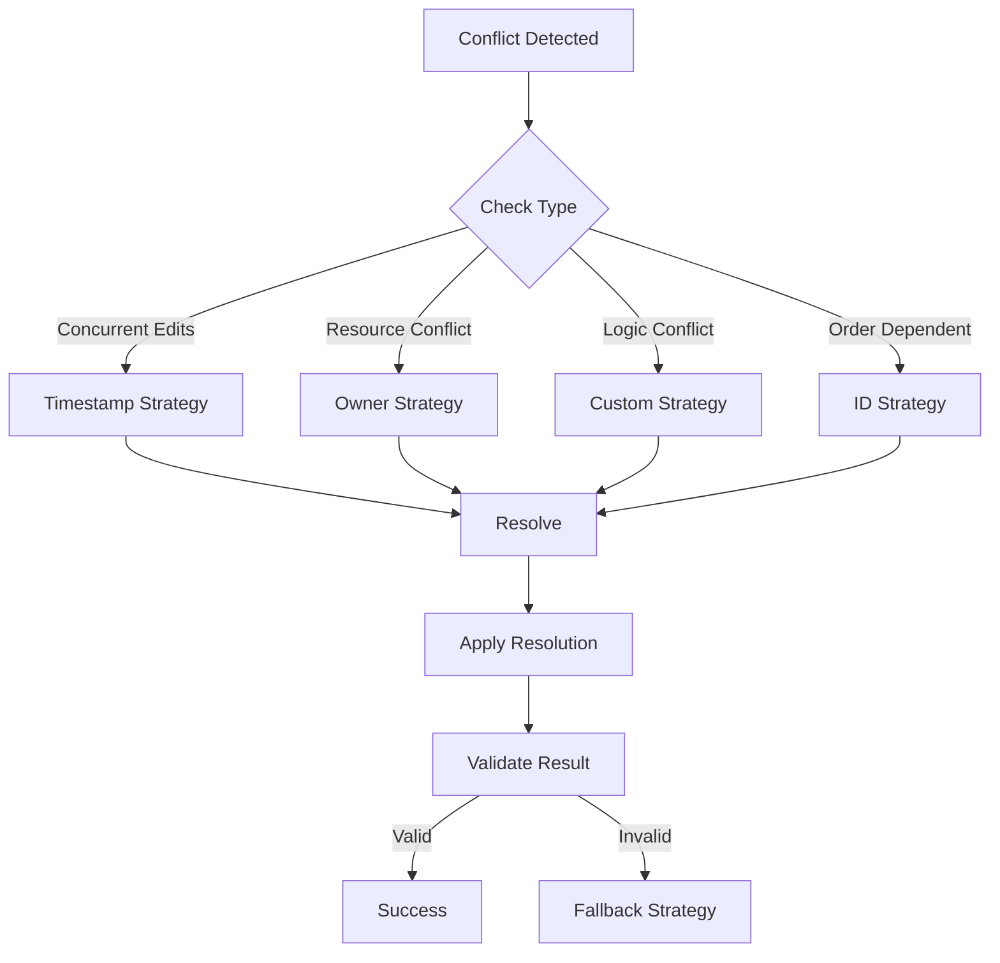

### Multi-Arbiter Coordination

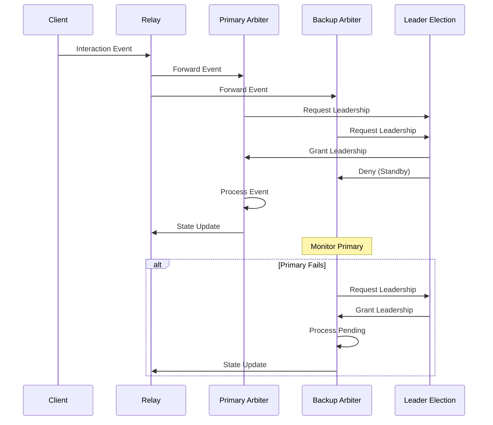

## Security Architecture

### Trust Model

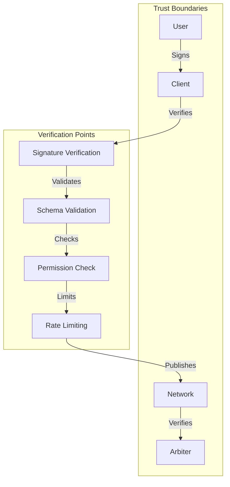

### Cryptographic Chain of Trust

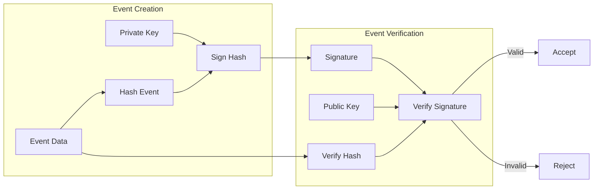

## Performance Architecture

### Optimization Layers

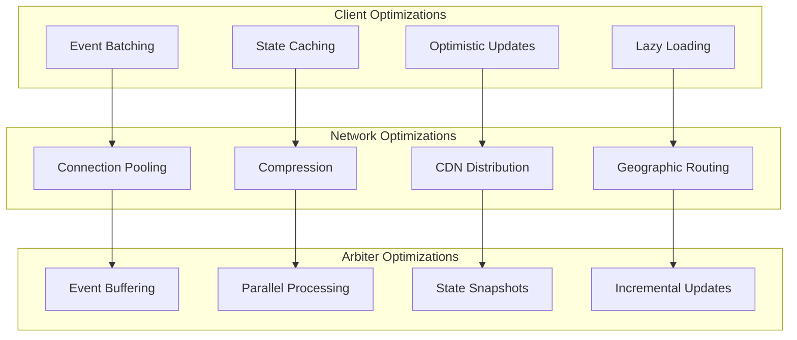

### Caching Strategy

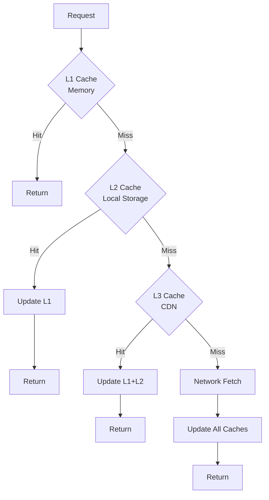

## Scalability Architecture

### Horizontal Scaling

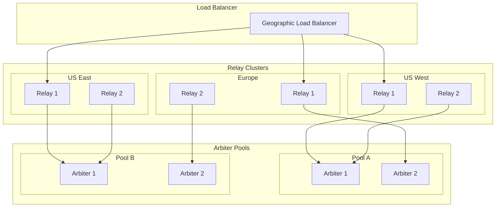

### Sharding Strategy

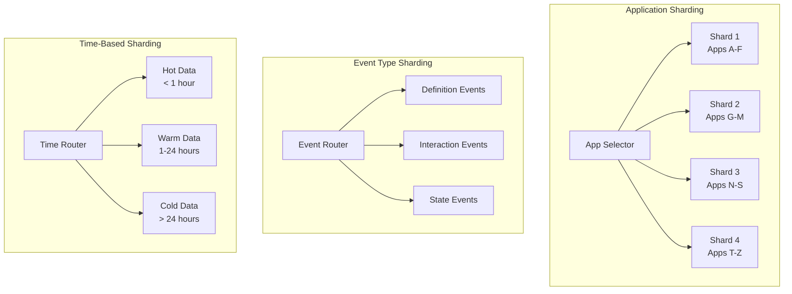

## Deployment Architecture

### Container Architecture

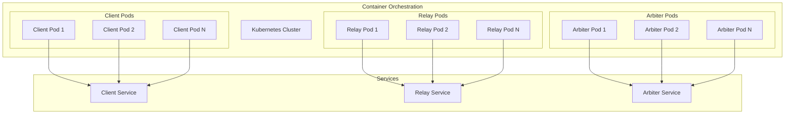

### Monitoring Architecture

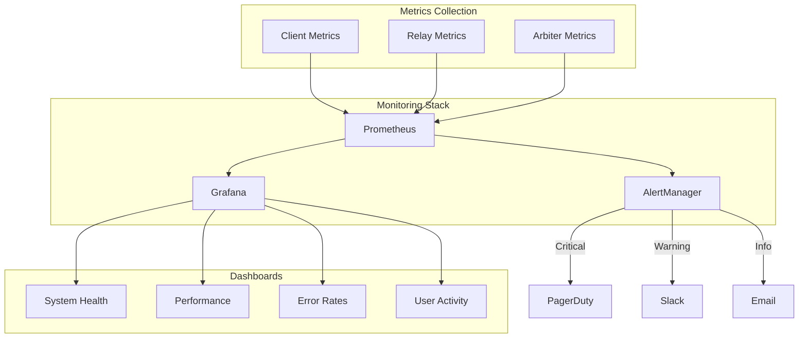

## Integration Patterns

### Client Integration

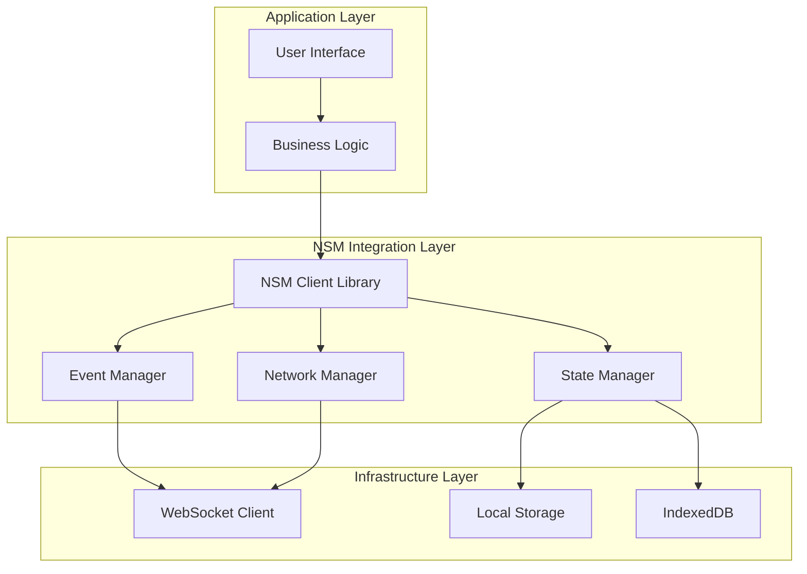

### Framework Adapters

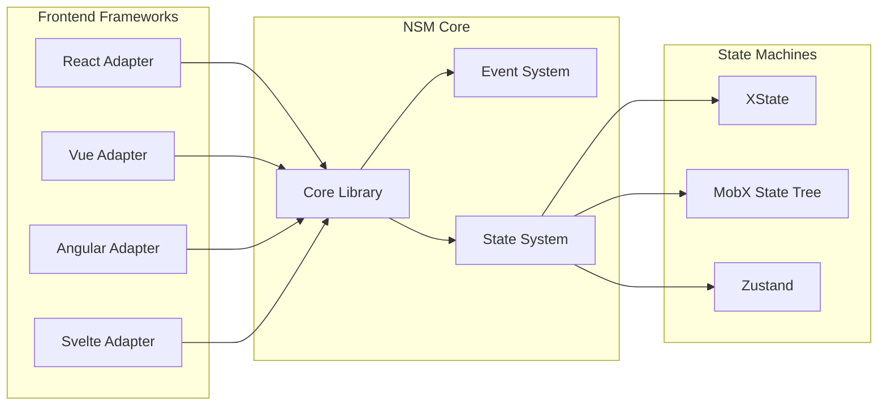

## Best Practices

### Architecture Principles

1. **Separation of Concerns**
   - Keep protocol logic separate from business logic
   - Isolate cryptographic operations
   - Decouple UI from state management

2. **Defensive Programming**
   - Validate all inputs
   - Handle network failures gracefully
   - Implement circuit breakers

3. **Performance First**
   - Design for minimal latency
   - Optimize for bandwidth efficiency
   - Implement progressive enhancement

4. **Security by Design**
   - Never trust client input
   - Validate cryptographic signatures
   - Implement rate limiting

5. **Scalability Planning**
   - Design for horizontal scaling
   - Implement efficient caching
   - Plan for data growth

### Implementation Guidelines

1. **Event Design**
   - Keep events small and focused
   - Use meaningful event types
   - Include necessary metadata

2. **State Management**
   - Minimize state size
   - Use immutable updates
   - Implement state versioning

3. **Network Optimization**
   - Batch related operations
   - Implement reconnection logic
   - Use connection pooling

4. **Error Handling**
   - Provide meaningful error messages
   - Implement retry mechanisms
   - Log errors for debugging

5. **Testing Strategy**
   - Test all state transitions
   - Simulate network failures
   - Validate conflict resolution

## Conclusion

The NSM architecture provides a robust foundation for building decentralized, collaborative applications. By following these architectural patterns and best practices, developers can create scalable, secure, and performant applications that leverage the power of the Nostr protocol for distributed state management.