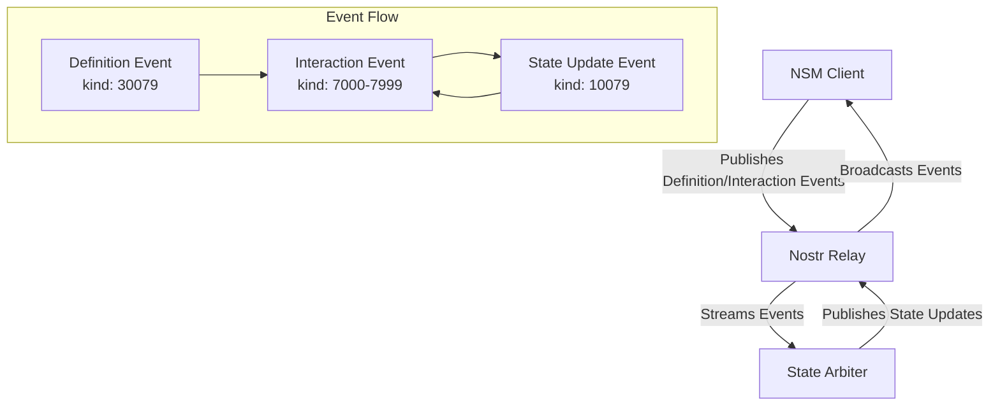

# NSM Implementation Guide

This document provides comprehensive implementation guidance for building NSM (Nostr State Machine) protocol support into clients, relays, and state arbiters.

## Architecture Overview

The NSM protocol consists of three main components that work together:



## Client Implementation

### Core Requirements

NSM-compatible clients MUST implement:

1. **Event Creation and Publishing**
2. **Event Validation and Processing**
3. **State Management and Synchronization**
4. **Conflict Resolution**
5. **Real-time Subscriptions**

### Step 1: Event Creation

#### Creating Definition Events

```typescript
import { createNSMDefinitionEvent } from '@nsm/core';

async function createDefinition(
  privateKey: string,
  metadata: NSMDefinitionMetadata,
  content: NSMDefinitionContent
) {
  // Create unsigned event
  const unsignedEvent = createNSMDefinitionEvent(metadata, content);

  // Add standard Nostr fields
  const event = {
    ...unsignedEvent,
    id: '', // Will be calculated
    pubkey: getPublicKey(privateKey),
    created_at: Math.floor(Date.now() / 1000),
    sig: '' // Will be calculated
  };

  // Calculate ID and signature
  event.id = await calculateEventId(event);
  event.sig = await signEvent(event, privateKey);

  return event;
}
```

#### Creating Interaction Events

```typescript
import { createNSMInteractionEvent } from '@nsm/core';

async function createInteraction(
  privateKey: string,
  appAddress: string,
  content: NSMInteractionContent,
  options?: NSMInteractionOptions
) {
  const unsignedEvent = createNSMInteractionEvent(appAddress, content, options);

  const event = {
    ...unsignedEvent,
    id: '',
    pubkey: getPublicKey(privateKey),
    created_at: Math.floor(Date.now() / 1000),
    sig: ''
  };

  event.id = await calculateEventId(event);
  event.sig = await signEvent(event, privateKey);

  return event;
}
```

### Step 2: Event Validation

Implement comprehensive validation for all incoming events:

```typescript
class NSMEventValidator {
  private definitionCache = new Map<string, NSMDefinitionContent>();

  async validateEvent(event: any): Promise<ValidationResult> {
    // 1. Basic Nostr event validation
    if (!await this.validateNostrEvent(event)) {
      return { success: false, error: 'Invalid Nostr event structure' };
    }

    // 2. Kind-specific validation
    switch (event.kind) {
      case 30079:
        return this.validateDefinitionEvent(event);
      case 10079:
        return this.validateStateUpdateEvent(event);
      default:
        if (event.kind >= 7000 && event.kind <= 7999) {
          return this.validateInteractionEvent(event);
        }
        return { success: false, error: 'Unsupported event kind' };
    }
  }

  private async validateDefinitionEvent(event: any): Promise<ValidationResult> {
    // Validate required tags
    const requiredTags = ['d', 'name', 'engine', 'engineCodeURI'];
    for (const tagName of requiredTags) {
      if (!event.tags.find(tag => tag[0] === tagName)) {
        return { success: false, error: `Missing required tag: ${tagName}` };
      }
    }

    // Validate JSON content
    try {
      const content = JSON.parse(event.content);
      return this.validateDefinitionContent(content);
    } catch (error) {
      return { success: false, error: 'Invalid JSON in content' };
    }
  }

  private async validateInteractionEvent(event: any): Promise<ValidationResult> {
    // Validate address tag
    const addressTag = event.tags.find(tag => tag[0] === 'a');
    if (!addressTag || !this.isValidAddress(addressTag[1])) {
      return { success: false, error: 'Invalid or missing address tag' };
    }

    // Get definition for schema validation
    const definition = await this.getDefinition(addressTag[1]);
    if (!definition) {
      return { success: false, error: 'Referenced definition not found' };
    }

    // Validate against interaction schema
    try {
      const content = JSON.parse(event.content);
      return this.validateAgainstSchema(content, definition.interactionSchema);
    } catch (error) {
      return { success: false, error: 'Invalid interaction content' };
    }
  }
}
```

### Step 3: State Management

Implement local state management with synchronization:

```typescript
class NSMStateMachine {
  private state: any;
  private definition: NSMDefinitionContent;
  private eventLog: NSMInteractionEvent[] = [];
  private stateVersion = 0;

  constructor(definition: NSMDefinitionContent) {
    this.definition = definition;
    this.state = { ...definition.initialState };
  }

  // Apply interaction event to state
  async applyInteraction(event: NSMInteractionEvent): Promise<boolean> {
    try {
      const content = JSON.parse(event.content);

      // Validate against schema
      if (!this.validateInteraction(content)) {
        return false;
      }

      // Apply state transition
      this.state = await this.executeTransition(this.state, content);
      this.eventLog.push(event);
      this.stateVersion++;

      this.notifyStateChange();
      return true;
    } catch (error) {
      console.error('Failed to apply interaction:', error);
      return false;
    }
  }

  // Synchronize with canonical state
  async synchronizeState(stateUpdate: NSMStateUpdateEvent): Promise<void> {
    const updateContent = JSON.parse(stateUpdate.content);

    // Check if this is a newer state
    if (updateContent.metadata?.stateVersion > this.stateVersion) {
      this.state = { ...updateContent.state };
      this.stateVersion = updateContent.metadata.stateVersion;
      this.notifyStateChange();
    }
  }

  private async executeTransition(currentState: any, interaction: any): Promise<any> {
    // This would integrate with your state machine engine (XState, etc.)
    // For demonstration, this is a simple reducer pattern
    switch (interaction.type) {
      case 'ADD_TODO':
        return {
          ...currentState,
          todos: [...currentState.todos, {
            id: interaction.payload.id,
            text: interaction.payload.text,
            completed: false,
            createdBy: interaction.payload.createdBy
          }]
        };

      case 'TOGGLE_TODO':
        return {
          ...currentState,
          todos: currentState.todos.map(todo =>
            todo.id === interaction.payload.id
              ? { ...todo, completed: !todo.completed }
              : todo
          )
        };

      default:
        throw new Error(`Unknown interaction type: ${interaction.type}`);
    }
  }
}
```

### Step 4: Real-time Subscriptions

Set up efficient event subscriptions:

```typescript
class NSMClient {
  private relay: NostrRelay;
  private subscriptions = new Map<string, string>();

  async subscribeToApp(appAddress: string): Promise<void> {
    const [kind, pubkey, identifier] = appAddress.split(':', 3);

    // Subscribe to definition events
    const defSub = await this.relay.subscribe([{
      kinds: [30079],
      authors: [pubkey],
      "#d": [identifier],
      limit: 1
    }]);

    // Subscribe to interaction events
    const interactionKind = this.getInteractionKind(appAddress);
    const intSub = await this.relay.subscribe([{
      kinds: [interactionKind],
      "#a": [appAddress],
      since: Math.floor(Date.now() / 1000) - 3600 // Last hour
    }]);

    // Subscribe to state updates
    const stateSub = await this.relay.subscribe([{
      kinds: [10079],
      "#a": [appAddress],
      limit: 1
    }]);

    this.subscriptions.set(appAddress, `${defSub},${intSub},${stateSub}`);
  }

  private async handleEvent(event: NostrEvent): Promise<void> {
    const validation = await this.validator.validateEvent(event);
    if (!validation.success) {
      console.warn('Invalid event received:', validation.error);
      return;
    }

    switch (event.kind) {
      case 30079:
        await this.handleDefinitionEvent(event);
        break;
      case 10079:
        await this.handleStateUpdateEvent(event);
        break;
      default:
        if (event.kind >= 7000 && event.kind <= 7999) {
          await this.handleInteractionEvent(event);
        }
    }
  }
}
```

### Step 5: Conflict Resolution

Implement conflict resolution strategies:

```typescript
class ConflictResolver {
  static resolveTimestampBased(events: NSMInteractionEvent[]): NSMInteractionEvent[] {
    return events.sort((a, b) => a.created_at - b.created_at);
  }

  static resolveIdBased(events: NSMInteractionEvent[]): NSMInteractionEvent[] {
    return events.sort((a, b) => a.id.localeCompare(b.id));
  }

  static resolveOwnerBased(
    events: NSMInteractionEvent[],
    ownerPubkey: string
  ): NSMInteractionEvent[] {
    return events.sort((a, b) => {
      // Owner events first
      if (a.pubkey === ownerPubkey && b.pubkey !== ownerPubkey) return -1;
      if (b.pubkey === ownerPubkey && a.pubkey !== ownerPubkey) return 1;

      // Then by timestamp
      return a.created_at - b.created_at;
    });
  }

  static async resolveCustom(
    events: NSMInteractionEvent[],
    resolver: (events: NSMInteractionEvent[]) => Promise<NSMInteractionEvent[]>
  ): Promise<NSMInteractionEvent[]> {
    return await resolver(events);
  }
}
```

## Relay Implementation

### Requirements for NSM Support

NSM-compatible relays SHOULD support:

1. **Parameterized Replaceable Events** (NIP-33) for Definition events
2. **Replaceable Events** (NIP-16) for State Update events
3. **Efficient Tag-based Filtering** for `a` tags
4. **Real-time Subscriptions** with low latency

### Tag Indexing

Implement efficient indexing for NSM-specific tags:

```sql
-- Database schema for NSM event indexing
CREATE TABLE nsm_definitions (
    event_id CHAR(64) PRIMARY KEY,
    pubkey CHAR(64) NOT NULL,
    identifier VARCHAR(255) NOT NULL,
    app_name VARCHAR(255),
    engine VARCHAR(100),
    created_at INTEGER,
    UNIQUE(pubkey, identifier)
);

CREATE TABLE nsm_interactions (
    event_id CHAR(64) PRIMARY KEY,
    app_address VARCHAR(500) NOT NULL,
    interaction_type VARCHAR(100),
    created_at INTEGER,
    INDEX(app_address, created_at)
);

CREATE TABLE nsm_states (
    app_address VARCHAR(500) PRIMARY KEY,
    event_id CHAR(64) NOT NULL,
    state_version INTEGER,
    created_at INTEGER
);
```

### Subscription Optimization

Optimize subscriptions for NSM event patterns:

```typescript
class NSMRelaySubscriptionHandler {
  async handleSubscription(filters: NostrFilter[]): Promise<string> {
    for (const filter of filters) {
      // Optimize NSM-specific subscriptions
      if (this.isNSMSubscription(filter)) {
        return this.handleNSMSubscription(filter);
      }
    }

    return this.handleGenericSubscription(filters);
  }

  private isNSMSubscription(filter: NostrFilter): boolean {
    return (
      (filter.kinds?.includes(30079) ||
       filter.kinds?.includes(10079) ||
       filter.kinds?.some(k => k >= 7000 && k <= 7999)) &&
      (filter["#a"] || filter["#d"])
    );
  }

  private async handleNSMSubscription(filter: NostrFilter): Promise<string> {
    // Use specialized NSM indexes for faster queries
    if (filter["#a"]) {
      return this.queryByAppAddress(filter);
    }

    if (filter["#d"] && filter.kinds?.includes(30079)) {
      return this.queryDefinitionByIdentifier(filter);
    }

    return this.handleGenericSubscription([filter]);
  }
}
```

## State Arbiter Implementation

State arbiters provide canonical state resolution for NSM applications.

### Core Architecture

```typescript
class NSMStateArbiter {
  private stateMachines = new Map<string, NSMStateMachine>();
  private eventBuffer = new Map<string, NSMInteractionEvent[]>();
  private processQueue = new AsyncQueue();

  async start(): Promise<void> {
    // Subscribe to all NSM events
    await this.subscribeToNSMEvents();

    // Start processing queue
    this.processQueue.start();

    // Start periodic state publication
    setInterval(() => this.publishStates(), 5000);
  }

  private async handleInteractionEvent(event: NSMInteractionEvent): Promise<void> {
    const addressTag = event.tags.find(tag => tag[0] === 'a');
    if (!addressTag) return;

    const appAddress = addressTag[1];

    // Add to processing queue
    this.processQueue.push(async () => {
      await this.processInteraction(appAddress, event);
    });
  }

  private async processInteraction(
    appAddress: string,
    event: NSMInteractionEvent
  ): Promise<void> {
    // Get or create state machine
    let stateMachine = this.stateMachines.get(appAddress);
    if (!stateMachine) {
      const definition = await this.getDefinition(appAddress);
      if (!definition) {
        console.error(`Definition not found for ${appAddress}`);
        return;
      }
      stateMachine = new NSMStateMachine(definition);
      this.stateMachines.set(appAddress, stateMachine);
    }

    // Buffer events for conflict resolution
    const buffer = this.eventBuffer.get(appAddress) || [];
    buffer.push(event);
    this.eventBuffer.set(appAddress, buffer);

    // Process buffered events if ready
    await this.processPendingEvents(appAddress);
  }

  private async processPendingEvents(appAddress: string): Promise<void> {
    const buffer = this.eventBuffer.get(appAddress) || [];
    if (buffer.length === 0) return;

    const stateMachine = this.stateMachines.get(appAddress);
    if (!stateMachine) return;

    // Apply conflict resolution
    const orderedEvents = ConflictResolver.resolveTimestampBased(buffer);

    // Apply events to state machine
    for (const event of orderedEvents) {
      const success = await stateMachine.applyInteraction(event);
      if (!success) {
        console.warn(`Failed to apply interaction ${event.id}`);
      }
    }

    // Clear buffer
    this.eventBuffer.set(appAddress, []);

    // Mark for state publication
    this.markForStatePublication(appAddress);
  }

  private async publishStates(): Promise<void> {
    for (const [appAddress, stateMachine] of this.stateMachines) {
      if (stateMachine.isDirty()) {
        await this.publishStateUpdate(appAddress, stateMachine);
      }
    }
  }

  private async publishStateUpdate(
    appAddress: string,
    stateMachine: NSMStateMachine
  ): Promise<void> {
    const stateUpdateContent = {
      state: stateMachine.getState(),
      metadata: {
        stateVersion: stateMachine.getVersion(),
        lastInteractionId: stateMachine.getLastInteractionId(),
        timestamp: Date.now(),
        conflictResolution: 'timestamp-based',
        arbiter: this.publicKey
      }
    };

    const event = await this.createStateUpdateEvent(appAddress, stateUpdateContent);
    await this.relay.publish(event);

    stateMachine.markClean();
  }
}
```

### Conflict Resolution Strategies

Implement multiple conflict resolution strategies:

```typescript
enum ConflictResolutionStrategy {
  TIMESTAMP_BASED = 'timestamp-based',
  ID_BASED = 'id-based',
  OWNER_BASED = 'owner-based',
  CUSTOM = 'custom'
}

class AdvancedConflictResolver {
  static async resolve(
    events: NSMInteractionEvent[],
    strategy: ConflictResolutionStrategy,
    options?: any
  ): Promise<NSMInteractionEvent[]> {
    switch (strategy) {
      case ConflictResolutionStrategy.TIMESTAMP_BASED:
        return this.resolveByTimestamp(events);

      case ConflictResolutionStrategy.ID_BASED:
        return this.resolveById(events);

      case ConflictResolutionStrategy.OWNER_BASED:
        return this.resolveByOwner(events, options.ownerPubkey);

      case ConflictResolutionStrategy.CUSTOM:
        return this.resolveCustom(events, options.resolver);

      default:
        throw new Error(`Unknown conflict resolution strategy: ${strategy}`);
    }
  }

  // Advanced conflict resolution with semantic understanding
  static async resolveWithSemantics(
    events: NSMInteractionEvent[],
    stateSchema: any
  ): Promise<NSMInteractionEvent[]> {
    // Group events by the state properties they affect
    const eventGroups = this.groupEventsByAffectedProperties(events, stateSchema);

    // Resolve conflicts within each group
    const resolvedGroups = await Promise.all(
      eventGroups.map(group => this.resolveGroupConflicts(group))
    );

    // Merge resolved groups back together
    return this.mergeResolvedGroups(resolvedGroups);
  }
}
```

## Security Implementation

### Cryptographic Validation

Implement robust cryptographic validation:

```typescript
class NSMCryptographicValidator {
  async validateEvent(event: NostrEvent): Promise<ValidationResult> {
    // 1. Validate event ID
    const expectedId = await this.calculateEventId(event);
    if (event.id !== expectedId) {
      return { success: false, error: 'Invalid event ID' };
    }

    // 2. Validate signature
    const isValidSignature = await this.verifySignature(event);
    if (!isValidSignature) {
      return { success: false, error: 'Invalid signature' };
    }

    // 3. Additional NSM-specific validations
    return this.validateNSMSpecific(event);
  }

  private async calculateEventId(event: NostrEvent): Promise<string> {
    const serialized = JSON.stringify([
      0,
      event.pubkey,
      event.created_at,
      event.kind,
      event.tags,
      event.content
    ]);

    return await this.sha256(serialized);
  }

  private async verifySignature(event: NostrEvent): Promise<boolean> {
    const message = await this.calculateEventId(event);
    return await this.schnorrVerify(event.sig, message, event.pubkey);
  }
}
```

### Access Control

Implement fine-grained access control:

```typescript
class NSMAccessController {
  private permissions = new Map<string, AppPermissions>();

  async canUserPublishInteraction(
    userPubkey: string,
    appAddress: string,
    interactionType: string
  ): Promise<boolean> {
    const permissions = await this.getAppPermissions(appAddress);

    // Check if user is banned
    if (permissions.bannedUsers.includes(userPubkey)) {
      return false;
    }

    // Check allowlist if exists
    if (permissions.allowedUsers.length > 0) {
      return permissions.allowedUsers.includes(userPubkey);
    }

    // Check interaction-specific permissions
    const interactionPermissions = permissions.interactions[interactionType];
    if (interactionPermissions) {
      return this.checkInteractionPermissions(userPubkey, interactionPermissions);
    }

    return permissions.defaultAllow;
  }

  async canUserAccessState(
    userPubkey: string,
    appAddress: string
  ): Promise<boolean> {
    const permissions = await this.getAppPermissions(appAddress);
    return !permissions.privateState || permissions.stateReaders.includes(userPubkey);
  }
}
```

## Performance Optimization

### Event Batching

Implement efficient event batching:

```typescript
class NSMEventBatcher {
  private batchSize = 100;
  private batchTimeout = 1000; // 1 second
  private pendingEvents = new Map<string, NSMInteractionEvent[]>();
  private batchTimers = new Map<string, NodeJS.Timeout>();

  async addEvent(appAddress: string, event: NSMInteractionEvent): Promise<void> {
    // Add to pending batch
    const batch = this.pendingEvents.get(appAddress) || [];
    batch.push(event);
    this.pendingEvents.set(appAddress, batch);

    // Process if batch is full
    if (batch.length >= this.batchSize) {
      await this.processBatch(appAddress);
      return;
    }

    // Set timeout for partial batch
    if (!this.batchTimers.has(appAddress)) {
      const timer = setTimeout(() => {
        this.processBatch(appAddress);
      }, this.batchTimeout);
      this.batchTimers.set(appAddress, timer);
    }
  }

  private async processBatch(appAddress: string): Promise<void> {
    const batch = this.pendingEvents.get(appAddress) || [];
    if (batch.length === 0) return;

    // Clear batch and timer
    this.pendingEvents.delete(appAddress);
    const timer = this.batchTimers.get(appAddress);
    if (timer) {
      clearTimeout(timer);
      this.batchTimers.delete(appAddress);
    }

    // Process batch
    await this.processEventBatch(appAddress, batch);
  }
}
```

### State Compression

Implement efficient state storage and transmission:

```typescript
class NSMStateCompressor {
  async compressState(state: any): Promise<string> {
    // JSON stringify with optimizations
    const jsonState = JSON.stringify(state, this.replacer);

    // Compress with gzip
    return await this.gzipCompress(jsonState);
  }

  async decompressState(compressedState: string): Promise<any> {
    // Decompress
    const jsonState = await this.gzipDecompress(compressedState);

    // Parse JSON
    return JSON.parse(jsonState, this.reviver);
  }

  private replacer(key: string, value: any): any {
    // Custom serialization for common patterns
    if (value instanceof Date) {
      return { __type: 'Date', value: value.toISOString() };
    }

    if (value instanceof Map) {
      return { __type: 'Map', value: Array.from(value.entries()) };
    }

    return value;
  }

  private reviver(key: string, value: any): any {
    // Custom deserialization
    if (value && value.__type === 'Date') {
      return new Date(value.value);
    }

    if (value && value.__type === 'Map') {
      return new Map(value.value);
    }

    return value;
  }
}
```

## Testing and Validation

### Integration Testing

Create comprehensive integration tests:

```typescript
describe('NSM Protocol Integration', () => {
  let client: NSMClient;
  let arbiter: NSMStateArbiter;
  let relay: TestRelay;

  beforeEach(async () => {
    relay = new TestRelay();
    client = new NSMClient({ relay });
    arbiter = new NSMStateArbiter({ relay });

    await relay.start();
    await arbiter.start();
  });

  test('end-to-end application lifecycle', async () => {
    // 1. Create and publish definition
    const definition = await client.createDefinition({
      identifier: 'test-app',
      name: 'Test Application',
      engine: 'xstate',
      engineCodeURI: 'https://example.com/test.js'
    }, {
      initialState: { counter: 0 },
      stateSchema: counterStateSchema,
      interactionSchema: counterInteractionSchema
    });

    await client.publishEvent(definition);
    await delay(100); // Allow propagation

    // 2. Send interaction
    const interaction = await client.createInteraction(
      definition.appAddress,
      { type: 'INCREMENT' }
    );

    await client.publishEvent(interaction);
    await delay(100); // Allow processing

    // 3. Verify state update
    const stateUpdates = await relay.getEvents({
      kinds: [10079],
      "#a": [definition.appAddress]
    });

    expect(stateUpdates).toHaveLength(1);

    const stateContent = JSON.parse(stateUpdates[0].content);
    expect(stateContent.state.counter).toBe(1);
  });

  test('conflict resolution', async () => {
    // Test concurrent interactions and conflict resolution
    // ... detailed test implementation
  });

  test('large scale performance', async () => {
    // Test with many users and interactions
    // ... performance test implementation
  });
});
```

### Conformance Testing

Create a conformance test suite:

```typescript
class NSMConformanceTests {
  static async runAll(implementation: NSMImplementation): Promise<TestResults> {
    const tests = [
      this.testEventCreation,
      this.testEventValidation,
      this.testStateTransitions,
      this.testConflictResolution,
      this.testSecurityValidation,
      this.testPerformanceRequirements
    ];

    const results = await Promise.all(
      tests.map(test => test(implementation))
    );

    return this.aggregateResults(results);
  }

  private static async testEventCreation(impl: NSMImplementation): Promise<TestResult> {
    // Test all event creation functions
    // Verify correct structure, tags, content format
  }

  private static async testEventValidation(impl: NSMImplementation): Promise<TestResult> {
    // Test validation with valid and invalid events
    // Verify error messages and handling
  }
}
```

## Deployment Considerations

### Production Checklist

Before deploying NSM implementations to production:

#### Client Checklist
- [ ] Event signature verification implemented
- [ ] Schema validation for all event types
- [ ] Conflict resolution strategy selected and tested
- [ ] Error handling and retry logic implemented
- [ ] Performance monitoring and metrics
- [ ] Security audit completed
- [ ] Conformance tests passing

#### Relay Checklist
- [ ] NSM event kind support (30079, 7000-7999, 10079)
- [ ] Efficient tag indexing for `a` tags
- [ ] Parameterized replaceable event support (NIP-33)
- [ ] Replaceable event support (NIP-16)
- [ ] Rate limiting and spam protection
- [ ] Monitoring and alerting
- [ ] Backup and recovery procedures

#### Arbiter Checklist
- [ ] State machine execution engine integrated
- [ ] Conflict resolution strategies implemented
- [ ] Event ordering and processing guarantees
- [ ] State publication reliability
- [ ] Monitoring and health checks
- [ ] Failover and recovery mechanisms
- [ ] Performance optimization and scaling

### Monitoring and Observability

Implement comprehensive monitoring:

```typescript
class NSMMetrics {
  static recordEventProcessing(eventKind: number, processingTime: number): void {
    prometheus.histogram('nsm_event_processing_duration_ms', {
      labels: { kind: eventKind.toString() }
    }).observe(processingTime);
  }

  static recordStateUpdate(appAddress: string, stateSize: number): void {
    prometheus.gauge('nsm_state_size_bytes', {
      labels: { app: appAddress }
    }).set(stateSize);
  }

  static recordConflictResolution(strategy: string, eventCount: number): void {
    prometheus.counter('nsm_conflicts_resolved_total', {
      labels: { strategy }
    }).inc();

    prometheus.histogram('nsm_conflict_event_count').observe(eventCount);
  }
}
```

This implementation guide provides the foundation for building robust NSM protocol support. Remember to thoroughly test your implementation and follow security best practices throughout the development process.