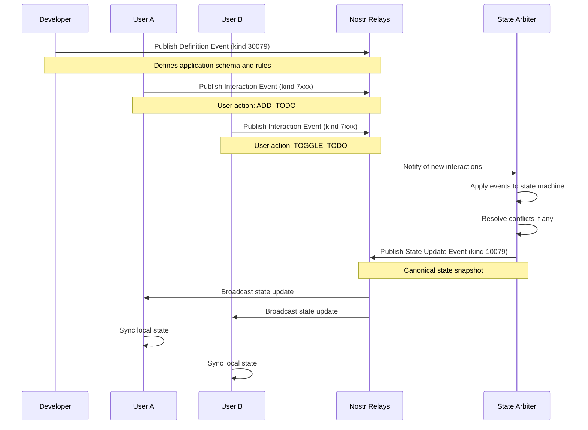

# NIP-??: Nostr State Machine Protocol

`draft` `optional`

## Abstract

This NIP defines a protocol extension for building deterministic, collaborative state machines on top of the Nostr protocol. The Nostr State Machine (NSM) protocol enables multiple users to participate in shared application states with automatic conflict resolution, real-time synchronization, and cryptographic integrity guarantees.

The protocol introduces three specialized event kinds that work together to create a complete state machine system: Definition events (kind 30079) for application schemas, Interaction events (kinds 7000-7999) for user actions, and State Update events (kind 10079) for canonical state snapshots.

## Motivation

Modern collaborative applications require real-time synchronization between multiple users while maintaining data consistency and conflict resolution. Existing approaches typically rely on centralized servers, which introduce single points of failure and censorship risks.

The NSM protocol addresses these challenges by:

- **Decentralization**: Leveraging Nostr's relay network eliminates central servers
- **Determinism**: State machines ensure predictable behavior across all participants
- **Conflict Resolution**: Built-in mechanisms handle concurrent user actions
- **Cryptographic Integrity**: All state changes are cryptographically signed and verifiable
- **Extensibility**: Framework-agnostic design supports various state machine engines

### Use Cases

- Real-time collaborative editors (documents, code, design)
- Multi-user games and simulations
- Collaborative task management and project planning
- Distributed decision-making and voting systems
- Real-time financial trading and auction systems
- Collaborative data analysis and visualization tools

## Specification

### Event Kinds

The NSM protocol defines three event kinds:

| Kind | Name | Type | Description |
|------|------|------|-------------|
| 30079 | Definition | Parameterized Replaceable | Application metadata and state machine definition |
| 7000-7999 | Interaction | Regular | User actions and state machine events |
| 10079 | State Update | Replaceable | Canonical state snapshots with conflict resolution |

### 1. NSM Definition Event (Kind 30079)

Definition events establish the rules and schema for an NSM application. These are parameterized replaceable events that define:

- Application metadata (name, description, version)
- State machine engine and code location
- Initial state structure
- JSON schemas for state and interaction validation
- UI specifications (optional)

#### Tags

| Tag | Required | Description | Example |
|-----|----------|-------------|---------|
| `d` | Yes | Application identifier | `["d", "collaborative-todo-v1"]` |
| `name` | Yes | Human-readable application name | `["name", "Collaborative Todo App"]` |
| `engine` | Yes | State machine engine identifier | `["engine", "xstate"]` |
| `engineCodeURI` | Yes | URI to state machine implementation | `["engineCodeURI", "https://example.com/todo.js"]` |
| `ui-spec` | No | UI specification URI | `["ui-spec", "https://example.com/todo-ui.json"]` |
| `version` | No | Application version | `["version", "1.2.0"]` |
| `description` | No | Application description | `["description", "Real-time collaborative task management"]` |

#### Content Structure

The `content` field contains JSON with the following structure:

```json
{
  "initialState": {
    "todos": [],
    "filter": "all",
    "nextId": 1
  },
  "stateSchema": {
    "type": "object",
    "properties": {
      "todos": {
        "type": "array",
        "items": {
          "type": "object",
          "properties": {
            "id": { "type": "number" },
            "text": { "type": "string" },
            "completed": { "type": "boolean" },
            "createdBy": { "type": "string" }
          },
          "required": ["id", "text", "completed", "createdBy"]
        }
      },
      "filter": { "type": "string", "enum": ["all", "active", "completed"] },
      "nextId": { "type": "number", "minimum": 1 }
    },
    "required": ["todos", "filter", "nextId"]
  },
  "interactionSchema": {
    "type": "object",
    "properties": {
      "type": { "type": "string" },
      "payload": { "type": "object" }
    },
    "required": ["type"]
  }
}
```

#### Example Definition Event

```json
{
  "id": "...",
  "pubkey": "abc123...",
  "created_at": 1234567890,
  "kind": 30079,
  "tags": [
    ["d", "collaborative-todo-v1"],
    ["name", "Collaborative Todo App"],
    ["engine", "xstate"],
    ["engineCodeURI", "https://cdn.example.com/todo-machine.js"],
    ["version", "1.0.0"],
    ["description", "Real-time collaborative task management"]
  ],
  "content": "{\"initialState\":{\"todos\":[],\"filter\":\"all\",\"nextId\":1},\"stateSchema\":{...},\"interactionSchema\":{...}}",
  "sig": "..."
}
```

### 2. NSM Interaction Event (Kinds 7000-7999)

Interaction events represent user actions that trigger state machine transitions. These are regular (immutable) events that capture user intentions and form an event log for the application.

#### Kind Assignment

Kinds within the 7000-7999 range are assigned deterministically based on the application identifier to avoid conflicts:

```javascript
function getInteractionKind(appAddress) {
  const hash = Array.from(appAddress).reduce((acc, char) => {
    return ((acc << 5) - acc + char.charCodeAt(0)) & 0xffffffff;
  }, 0);
  return 7000 + (Math.abs(hash) % 1000);
}
```

#### Tags

| Tag | Required | Description | Example |
|-----|----------|-------------|---------|
| `a` | Yes | Address to NSM Definition event | `["a", "30079:abc123...:collaborative-todo-v1"]` |
| `p` | No | Participant pubkey (can be multiple) | `["p", "def456..."]` |

#### Content Structure

```json
{
  "type": "ADD_TODO",
  "payload": {
    "text": "Buy groceries",
    "id": 5
  },
  "metadata": {
    "timestamp": 1234567890123,
    "sessionId": "session-abc-123",
    "userAgent": "Mozilla/5.0..."
  }
}
```

#### Example Interaction Event

```json
{
  "id": "...",
  "pubkey": "def456...",
  "created_at": 1234567891,
  "kind": 7042,
  "tags": [
    ["a", "30079:abc123...:collaborative-todo-v1"],
    ["p", "abc123..."]
  ],
  "content": "{\"type\":\"ADD_TODO\",\"payload\":{\"text\":\"Buy groceries\",\"id\":5}}",
  "sig": "..."
}
```

### 3. NSM State Update Event (Kind 10079)

State Update events represent canonical state snapshots after applying interaction events. These are replaceable events that provide conflict resolution and enable efficient state synchronization.

#### Tags

| Tag | Required | Description | Example |
|-----|----------|-------------|---------|
| `a` | Yes | Address to NSM Definition event | `["a", "30079:abc123...:collaborative-todo-v1"]` |
| `p` | No | Participant pubkey (can be multiple) | `["p", "def456..."]` |
| `arbiter` | No | State arbiter pubkey | `["arbiter", "ghi789..."]` |

#### Content Structure

```json
{
  "state": {
    "todos": [
      {
        "id": 1,
        "text": "Buy groceries",
        "completed": false,
        "createdBy": "def456..."
      }
    ],
    "filter": "all",
    "nextId": 2
  },
  "metadata": {
    "stateVersion": 15,
    "lastInteractionId": "interaction-event-id-123",
    "timestamp": 1234567892000,
    "conflictResolution": "timestamp-based",
    "arbiter": "ghi789...",
    "canonicalStateHash": "sha256:abc123..."
  }
}
```

#### Example State Update Event

```json
{
  "id": "...",
  "pubkey": "ghi789...",
  "created_at": 1234567892,
  "kind": 10079,
  "tags": [
    ["a", "30079:abc123...:collaborative-todo-v1"],
    ["p", "def456..."],
    ["arbiter", "ghi789..."]
  ],
  "content": "{\"state\":{\"todos\":[{\"id\":1,\"text\":\"Buy groceries\",\"completed\":false,\"createdBy\":\"def456...\"}],\"filter\":\"all\",\"nextId\":2},\"metadata\":{...}}",
  "sig": "..."
}
```

## Protocol Flow



## Conflict Resolution

The NSM protocol supports multiple conflict resolution strategies:

### 1. Timestamp-Based Resolution

Events are ordered by their `created_at` timestamp. Earlier events take precedence.

```javascript
function resolveConflict(events) {
  return events.sort((a, b) => a.created_at - b.created_at);
}
```

### 2. ID-Based Resolution

Events are ordered lexicographically by their event ID.

```javascript
function resolveConflict(events) {
  return events.sort((a, b) => a.id.localeCompare(b.id));
}
```

### 3. Owner-Based Resolution

The application owner's events take precedence, followed by timestamp ordering.

```javascript
function resolveConflict(events, ownerPubkey) {
  return events.sort((a, b) => {
    if (a.pubkey === ownerPubkey && b.pubkey !== ownerPubkey) return -1;
    if (b.pubkey === ownerPubkey && a.pubkey !== ownerPubkey) return 1;
    return a.created_at - b.created_at;
  });
}
```

## Security Considerations

### Event Validation

All events MUST be cryptographically validated:

1. **Signature Verification**: Verify that events are properly signed by their claimed authors
2. **Schema Validation**: Interaction events MUST conform to the `interactionSchema` defined in the Definition event
3. **State Validation**: State Update events MUST conform to the `stateSchema` defined in the Definition event
4. **Timestamp Validation**: Events with unreasonable timestamps (too far in past/future) SHOULD be rejected

### Access Control

Applications MAY implement access control through:

1. **Participant Lists**: Using `p` tags to define authorized participants
2. **Signature Requirements**: Requiring specific pubkeys for certain operations
3. **State Arbiters**: Designating trusted entities for conflict resolution

### Data Privacy

Since Nostr events are public by default:

1. **Sensitive Data**: Applications SHOULD encrypt sensitive content using NIP-04 or similar
2. **Private Applications**: Consider using private relays for sensitive use cases
3. **Minimal Exposure**: Only include necessary data in public events

## Implementation Requirements

### Client Requirements

NSM-compatible clients MUST:

1. Support all three NSM event kinds (30079, 7000-7999, 10079)
2. Validate event signatures and content schemas
3. Implement at least one conflict resolution strategy
4. Handle event ordering and state reconstruction
5. Provide mechanisms for state synchronization

### Relay Requirements

NSM-compatible relays SHOULD:

1. Support parameterized replaceable events (NIP-33) for Definition events
2. Support replaceable events (NIP-16) for State Update events
3. Efficiently handle event filtering by `a` tags
4. Provide subscription mechanisms for real-time updates

### State Arbiter Requirements

State arbiters (optional but recommended) SHOULD:

1. Monitor Definition and Interaction events for assigned applications
2. Maintain authoritative state by applying interaction events
3. Publish State Update events when state changes occur
4. Implement consistent conflict resolution policies
5. Provide state query endpoints for efficient synchronization

## Backward Compatibility

This NIP introduces new event kinds that do not conflict with existing NIPs. Existing Nostr clients and relays will handle NSM events as regular events, though they won't benefit from the state machine semantics.

NSM applications can gracefully degrade by:

1. Operating without State Update events (using only Interaction events)
2. Implementing client-side conflict resolution when arbiters are unavailable
3. Falling back to traditional event-based synchronization

## Reference Implementation

A reference implementation is available at: https://github.com/example/nsm-framework

### Libraries and Tools

- **@nsm/core**: Core protocol implementation and validation
- **@nsm/client**: Client-side state machine integration
- **@nsm/arbiter**: State arbiter service implementation
- **@nsm/dev-tools**: Development and debugging tools

## Test Vectors

### Valid Definition Event

```json
{
  "id": "4f46e8b9a8b7c8d9e0f1a2b3c4d5e6f7a8b9c0d1e2f3a4b5c6d7e8f9a0b1c2d3",
  "pubkey": "32e1827635450ebb3c5a7d12c1f8e7b2b514439ac10a67eef3d9fd9c5c68e245",
  "created_at": 1677721121,
  "kind": 30079,
  "tags": [
    ["d", "counter-app"],
    ["name", "Simple Counter"],
    ["engine", "xstate"],
    ["engineCodeURI", "https://cdn.example.com/counter.js"],
    ["version", "1.0.0"]
  ],
  "content": "{\"initialState\":{\"count\":0},\"stateSchema\":{\"type\":\"object\",\"properties\":{\"count\":{\"type\":\"number\"}},\"required\":[\"count\"]},\"interactionSchema\":{\"type\":\"object\",\"properties\":{\"type\":{\"type\":\"string\",\"enum\":[\"INCREMENT\",\"DECREMENT\"]}},\"required\":[\"type\"]}}",
  "sig": "3044022059b2b7d7d24f5e6d1e2f3a4b5c6d7e8f9a0b1c2d3e4f5a6b7c8d9e0f1a2b3c4d5022069a1b2c3d4e5f6a7b8c9d0e1f2a3b4c5d6e7f8a9b0c1d2e3f4a5b6c7d8e9f0a1"
}
```

### Valid Interaction Event

```json
{
  "id": "1234567890abcdef1234567890abcdef1234567890abcdef1234567890abcdef",
  "pubkey": "87f4f6e8c4d2a9b7f5e3d1c9a7b5f3e1d9c7b5f3e1d9c7b5f3e1d9c7b5f3e1",
  "created_at": 1677721122,
  "kind": 7123,
  "tags": [
    ["a", "30079:32e1827635450ebb3c5a7d12c1f8e7b2b514439ac10a67eef3d9fd9c5c68e245:counter-app"]
  ],
  "content": "{\"type\":\"INCREMENT\"}",
  "sig": "30450221009a2b3c4d5e6f7a8b9c0d1e2f3a4b5c6d7e8f9a0b1c2d3e4f5a6b7c8d9e0f1a2b3c4d5022100a1b2c3d4e5f6a7b8c9d0e1f2a3b4c5d6e7f8a9b0c1d2e3f4a5b6c7d8e9f0a1b2"
}
```

### Valid State Update Event

```json
{
  "id": "abcdef1234567890abcdef1234567890abcdef1234567890abcdef1234567890",
  "pubkey": "a1b2c3d4e5f6a7b8c9d0e1f2a3b4c5d6e7f8a9b0c1d2e3f4a5b6c7d8e9f0a1b2",
  "created_at": 1677721123,
  "kind": 10079,
  "tags": [
    ["a", "30079:32e1827635450ebb3c5a7d12c1f8e7b2b514439ac10a67eef3d9fd9c5c68e245:counter-app"]
  ],
  "content": "{\"state\":{\"count\":1},\"metadata\":{\"stateVersion\":2,\"lastInteractionId\":\"1234567890abcdef1234567890abcdef1234567890abcdef1234567890abcdef\",\"timestamp\":1677721123000,\"conflictResolution\":\"timestamp-based\"}}",
  "sig": "304502210098765432109876543210987654321098765432109876543210987654321098765432022100123456789012345678901234567890123456789012345678901234567890123456"
}
```

## Authors

- Developer Name <developer@example.com>
- NSM Framework Contributors

## References

- [NIP-01: Basic protocol flow description](https://github.com/nostr-protocol/nips/blob/master/01.md)
- [NIP-16: Event Treatment](https://github.com/nostr-protocol/nips/blob/master/16.md)
- [NIP-33: Parameterized Replaceable Events](https://github.com/nostr-protocol/nips/blob/master/33.md)
- [XState Documentation](https://xstate.js.org/docs/)
- [JSON Schema Specification](https://json-schema.org/)

## Changelog

- **2024-01-15**: Initial draft
- **2024-01-20**: Added conflict resolution mechanisms
- **2024-01-25**: Refined event schemas and validation rules
- **2024-02-01**: Added test vectors and implementation requirements