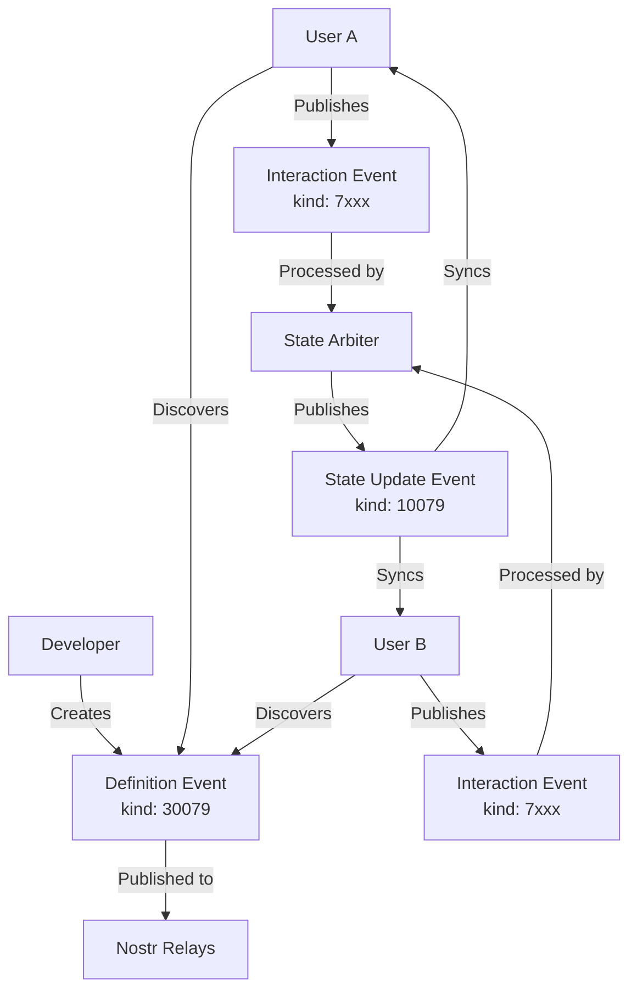
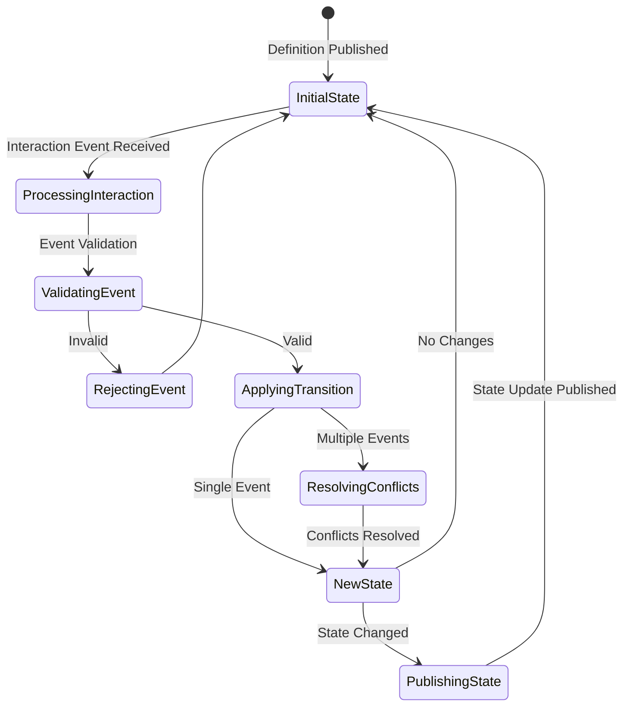
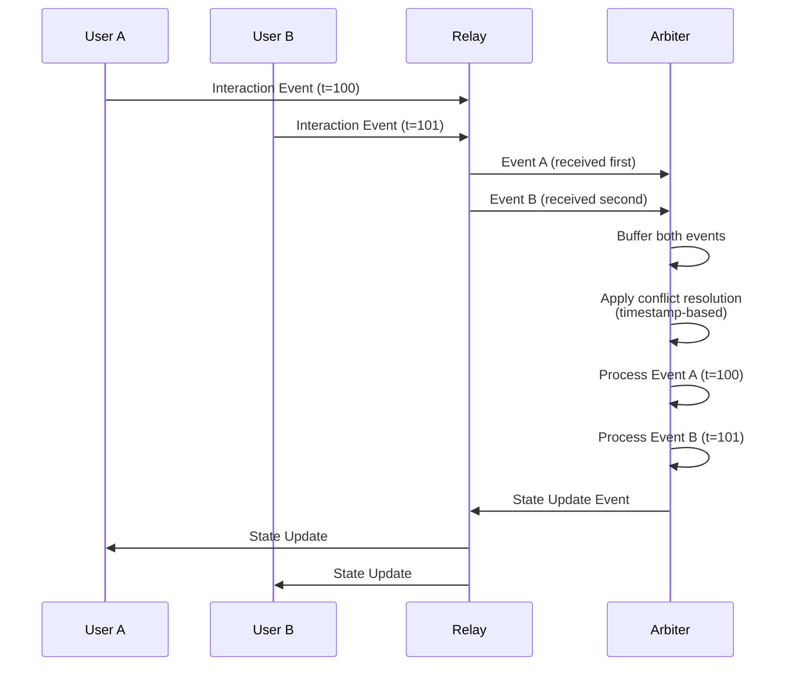
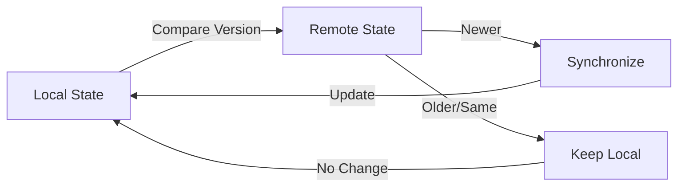

# NSM Protocol Reference

Quick reference guide for developers implementing or working with the NSM (Nostr State Machine) protocol.

## Event Kinds Quick Reference

| Kind | Name | Type | Purpose | Replaceability |
|------|------|------|---------|----------------|
| 30079 | Definition | Parameterized Replaceable | Application schema & metadata | Yes (by `d` tag) |
| 7000-7999 | Interaction | Regular | User actions & state transitions | No (immutable) |
| 10079 | State Update | Replaceable | Canonical state snapshots | Yes (newest wins) |

## Address Format

NSM applications are referenced using a standardized address format:

```
30079:pubkey:identifier
```

- `30079`: Event kind for Definition events
- `pubkey`: 64-character hex public key of application creator
- `identifier`: Unique identifier from the `d` tag

**Example**: `30079:32e1827635450ebb3c5a7d12c1f8e7b2b514439ac10a67eef3d9fd9c5c68e245:todo-app-v1`

## Event Flow Diagrams

### Application Lifecycle



### State Machine Flow



### Conflict Resolution Flow



## JSON Schemas Reference

### Definition Event Content Schema

```json
{
  "$schema": "http://json-schema.org/draft-07/schema#",
  "type": "object",
  "properties": {
    "initialState": {
      "type": "object",
      "description": "Starting state of the application"
    },
    "stateSchema": {
      "$ref": "#/definitions/jsonSchema",
      "description": "JSON Schema for valid state structure"
    },
    "interactionSchema": {
      "$ref": "#/definitions/jsonSchema",
      "description": "JSON Schema for valid interaction structure"
    }
  },
  "required": ["initialState", "stateSchema", "interactionSchema"],
  "definitions": {
    "jsonSchema": {
      "type": "object",
      "properties": {
        "type": { "type": "string" },
        "properties": { "type": "object" },
        "required": { "type": "array", "items": { "type": "string" } },
        "enum": { "type": "array" }
      },
      "required": ["type"]
    }
  }
}
```

### Interaction Event Content Schema

```json
{
  "$schema": "http://json-schema.org/draft-07/schema#",
  "type": "object",
  "properties": {
    "type": {
      "type": "string",
      "minLength": 1,
      "description": "Action type (must conform to interactionSchema)"
    },
    "payload": {
      "type": "object",
      "description": "Optional action payload"
    },
    "metadata": {
      "type": "object",
      "properties": {
        "timestamp": { "type": "integer" },
        "sessionId": { "type": "string" },
        "userAgent": { "type": "string" },
        "clientVersion": { "type": "string" }
      }
    }
  },
  "required": ["type"]
}
```

### State Update Event Content Schema

```json
{
  "$schema": "http://json-schema.org/draft-07/schema#",
  "type": "object",
  "properties": {
    "state": {
      "type": "object",
      "description": "Current application state"
    },
    "metadata": {
      "type": "object",
      "properties": {
        "stateVersion": { "type": "integer", "minimum": 1 },
        "lastInteractionId": { "type": "string", "pattern": "^[a-fA-F0-9]{64}$" },
        "timestamp": { "type": "integer" },
        "conflictResolution": {
          "type": "string",
          "enum": ["timestamp-based", "id-based", "owner-based", "custom"]
        },
        "arbiter": { "type": "string", "pattern": "^[a-fA-F0-9]{64}$" },
        "canonicalStateHash": { "type": "string" },
        "appliedInteractions": {
          "type": "array",
          "items": { "type": "string", "pattern": "^[a-fA-F0-9]{64}$" }
        }
      }
    }
  },
  "required": ["state"]
}
```

## Tag Reference

### Definition Event Tags (Kind 30079)

| Tag | Required | Format | Description | Example |
|-----|----------|--------|-------------|---------|
| `d` | ✓ | `["d", identifier]` | Application identifier | `["d", "collaborative-todo"]` |
| `name` | ✓ | `["name", appName]` | Human-readable name | `["name", "Collaborative Todo"]` |
| `engine` | ✓ | `["engine", engineId]` | State machine engine | `["engine", "xstate"]` |
| `engineCodeURI` | ✓ | `["engineCodeURI", uri]` | Engine implementation URI | `["engineCodeURI", "https://cdn.example.com/app.js"]` |
| `ui-spec` | | `["ui-spec", uri]` | UI specification URI | `["ui-spec", "https://example.com/ui.json"]` |
| `version` | | `["version", semver]` | Application version | `["version", "1.2.0"]` |
| `description` | | `["description", text]` | App description | `["description", "Real-time task management"]` |

### Interaction Event Tags (Kinds 7000-7999)

| Tag | Required | Format | Description | Example |
|-----|----------|--------|-------------|---------|
| `a` | ✓ | `["a", address]` | App address reference | `["a", "30079:abc123...:todo-app"]` |
| `p` | | `["p", pubkey]` | Participant pubkey | `["p", "def456..."]` |

### State Update Event Tags (Kind 10079)

| Tag | Required | Format | Description | Example |
|-----|----------|--------|-------------|---------|
| `a` | ✓ | `["a", address]` | App address reference | `["a", "30079:abc123...:todo-app"]` |
| `p` | | `["p", pubkey]` | Participant pubkey | `["p", "def456..."]` |
| `arbiter` | | `["arbiter", pubkey]` | State arbiter pubkey | `["arbiter", "ghi789..."]` |

## Subscription Patterns

### Subscribe to Application Events

```json
[
  "REQ",
  "sub-id",
  {
    "kinds": [30079],
    "authors": ["32e1827635450ebb3c5a7d12c1f8e7b2b514439ac10a67eef3d9fd9c5c68e245"],
    "#d": ["todo-app"],
    "limit": 1
  }
]
```

### Subscribe to Interactions

```json
[
  "REQ",
  "sub-id",
  {
    "kinds": [7234],
    "#a": ["30079:32e1827635450ebb3c5a7d12c1f8e7b2b514439ac10a67eef3d9fd9c5c68e245:todo-app"],
    "since": 1677721000
  }
]
```

### Subscribe to State Updates

```json
[
  "REQ",
  "sub-id",
  {
    "kinds": [10079],
    "#a": ["30079:32e1827635450ebb3c5a7d12c1f8e7b2b514439ac10a67eef3d9fd9c5c68e245:todo-app"],
    "limit": 1
  }
]
```

### Real-time Application Monitoring

```json
[
  "REQ",
  "monitor",
  {
    "kinds": [7234, 10079],
    "#a": ["30079:32e1827635450ebb3c5a7d12c1f8e7b2b514439ac10a67eef3d9fd9c5c68e245:todo-app"],
    "since": 1677721000
  }
]
```

## Conflict Resolution Strategies

### Timestamp-Based (Default)

Events are ordered by `created_at` timestamp (earlier wins):

```javascript
function resolveTimestampBased(events) {
  return events.sort((a, b) => a.created_at - b.created_at);
}
```

**Pros**: Simple, predictable
**Cons**: Vulnerable to clock skew

### ID-Based

Events are ordered lexicographically by event ID:

```javascript
function resolveIdBased(events) {
  return events.sort((a, b) => a.id.localeCompare(b.id));
}
```

**Pros**: Clock-independent, deterministic
**Cons**: No semantic meaning

### Owner-Based

Application owner's events take precedence:

```javascript
function resolveOwnerBased(events, ownerPubkey) {
  return events.sort((a, b) => {
    if (a.pubkey === ownerPubkey && b.pubkey !== ownerPubkey) return -1;
    if (b.pubkey === ownerPubkey && a.pubkey !== ownerPubkey) return 1;
    return a.created_at - b.created_at;
  });
}
```

**Pros**: Authoritative control
**Cons**: Centralized decision-making

### Custom Resolution

Application-specific conflict resolution:

```javascript
async function resolveCustom(events, resolver) {
  return await resolver(events);
}
```

**Pros**: Maximum flexibility
**Cons**: Complexity, potential inconsistency

## State Machine Lifecycle

### Application Initialization

1. **Developer** creates Definition event with:
   - Application metadata
   - Initial state
   - State and interaction schemas
   - State machine implementation URI

2. **Definition** is published to Nostr relays

3. **Users** discover the application through:
   - Direct sharing of app address
   - Application directories
   - Social recommendations

### User Interaction Flow

1. **User** loads application definition
2. **Client** validates schemas and initializes state machine
3. **User** performs action (UI interaction)
4. **Client** creates Interaction event
5. **Interaction** is published to relays
6. **Arbiters** process interactions and resolve conflicts
7. **State Update** is published with canonical state
8. **Clients** synchronize with updated state

### State Synchronization



## Validation Rules Summary

### Event Structure Validation

- **Event ID**: 64-character hex string (SHA-256 hash)
- **Public Key**: 64-character hex string
- **Signature**: 128-character hex string (Schnorr signature)
- **Timestamp**: Unix timestamp in seconds
- **Kind**: Must be 30079, 7000-7999, or 10079
- **Tags**: Array of string arrays
- **Content**: Valid JSON string

### Content Validation

#### Definition Events
- `initialState`: Any valid JSON object
- `stateSchema`: Valid JSON Schema with `type: "object"`
- `interactionSchema`: Valid JSON Schema with `type: "object"`

#### Interaction Events
- `type`: Non-empty string matching interaction schema
- `payload`: Object conforming to interaction-specific schema
- `metadata`: Optional object with standard fields

#### State Update Events
- `state`: Object conforming to state schema from Definition
- `metadata`: Optional object with versioning and conflict info

### Tag Validation

- **Address Tags**: Must match format `30079:pubkey:identifier`
- **Required Tags**: All required tags must be present with non-empty values
- **Pubkey Tags**: Must be valid 64-character hex strings

## Error Codes Reference

### Validation Errors

| Code | Name | Description |
|------|------|-------------|
| `NSM001` | `INVALID_EVENT_STRUCTURE` | Basic Nostr event validation failed |
| `NSM002` | `INVALID_SIGNATURE` | Event signature verification failed |
| `NSM003` | `INVALID_JSON_CONTENT` | Content is not valid JSON |
| `NSM004` | `MISSING_REQUIRED_TAGS` | Required tags are missing |
| `NSM005` | `INVALID_ADDRESS_TAG` | Address tag format is invalid |
| `NSM006` | `SCHEMA_VALIDATION_FAILED` | Content doesn't match required schema |
| `NSM007` | `KIND_OUT_OF_RANGE` | Event kind is not supported |
| `NSM008` | `TIMESTAMP_VALIDATION_FAILED` | Timestamp is unreasonable |
| `NSM009` | `DEFINITION_NOT_FOUND` | Referenced definition event not found |
| `NSM010` | `STATE_VERSION_CONFLICT` | State version conflicts with existing |

### Runtime Errors

| Code | Name | Description |
|------|------|-------------|
| `NSM101` | `STATE_TRANSITION_FAILED` | State machine transition failed |
| `NSM102` | `CONFLICT_RESOLUTION_FAILED` | Unable to resolve event conflicts |
| `NSM103` | `ARBITER_UNAVAILABLE` | No state arbiter available |
| `NSM104` | `RELAY_CONNECTION_FAILED` | Unable to connect to Nostr relays |
| `NSM105` | `SUBSCRIPTION_FAILED` | Event subscription failed |
| `NSM106` | `PUBLICATION_FAILED` | Event publication failed |
| `NSM107` | `SYNCHRONIZATION_FAILED` | State synchronization failed |
| `NSM108` | `PERMISSION_DENIED` | User lacks required permissions |

## Best Practices

### Event Design

1. **Keep Events Small**: Optimize for relay performance
2. **Use Meaningful Types**: Clear, descriptive interaction types
3. **Include Metadata**: Add context for debugging and analytics
4. **Version Your Schemas**: Support schema evolution
5. **Validate Early**: Validate events before publishing

### State Management

1. **Minimize State Size**: Only store essential data
2. **Design for Conflicts**: Anticipate concurrent modifications
3. **Use Incremental Updates**: Avoid full state replacements
4. **Cache Efficiently**: Balance memory and performance
5. **Monitor State Growth**: Prevent unbounded growth

### Security

1. **Validate Everything**: Never trust incoming events
2. **Implement Rate Limiting**: Prevent spam and abuse
3. **Use Access Controls**: Restrict sensitive operations
4. **Audit Event History**: Maintain comprehensive logs
5. **Encrypt Sensitive Data**: Use appropriate encryption for private data

### Performance

1. **Batch Operations**: Group related events
2. **Use Efficient Subscriptions**: Minimize network traffic
3. **Implement Caching**: Cache frequently accessed data
4. **Monitor Metrics**: Track performance indicators
5. **Optimize for Scale**: Design for growth

## Common Patterns

### Todo Application Pattern

```json
{
  "initialState": {
    "todos": [],
    "filter": "all",
    "nextId": 1
  },
  "interactionSchema": {
    "type": "object",
    "properties": {
      "type": {
        "type": "string",
        "enum": ["ADD_TODO", "TOGGLE_TODO", "DELETE_TODO", "SET_FILTER"]
      },
      "payload": {"type": "object"}
    },
    "required": ["type"]
  }
}
```

### Counter Application Pattern

```json
{
  "initialState": {
    "count": 0
  },
  "interactionSchema": {
    "type": "object",
    "properties": {
      "type": {
        "type": "string",
        "enum": ["INCREMENT", "DECREMENT", "RESET"]
      }
    },
    "required": ["type"]
  }
}
```

### Chat Application Pattern

```json
{
  "initialState": {
    "messages": [],
    "users": []
  },
  "interactionSchema": {
    "type": "object",
    "properties": {
      "type": {
        "type": "string",
        "enum": ["SEND_MESSAGE", "JOIN_CHAT", "LEAVE_CHAT"]
      },
      "payload": {"type": "object"}
    },
    "required": ["type"]
  }
}
```

### Collaborative Editor Pattern

```json
{
  "initialState": {
    "document": "",
    "cursors": {},
    "version": 0
  },
  "interactionSchema": {
    "type": "object",
    "properties": {
      "type": {
        "type": "string",
        "enum": ["INSERT_TEXT", "DELETE_TEXT", "MOVE_CURSOR", "SELECT_TEXT"]
      },
      "payload": {
        "type": "object",
        "properties": {
          "position": {"type": "number"},
          "text": {"type": "string"},
          "length": {"type": "number"}
        }
      }
    },
    "required": ["type", "payload"]
  }
}
```

## Debugging Tools

### Event Inspector

Validate and inspect NSM events:

```bash
nsm-cli validate-event event.json
nsm-cli inspect-event event.json --verbose
nsm-cli decode-event event.json --format pretty
```

### State Debugger

Debug state machine execution:

```bash
nsm-cli debug-state --app "30079:pubkey:identifier"
nsm-cli replay-events --app "30079:pubkey:identifier" --from 1677721000
nsm-cli diff-states state1.json state2.json
```

### Performance Profiler

Profile NSM operations:

```bash
nsm-cli profile --app "30079:pubkey:identifier" --duration 60s
nsm-cli benchmark --events 1000 --concurrency 10
nsm-cli analyze-performance logs/
```

This reference guide provides quick access to all essential NSM protocol information for efficient development and debugging.