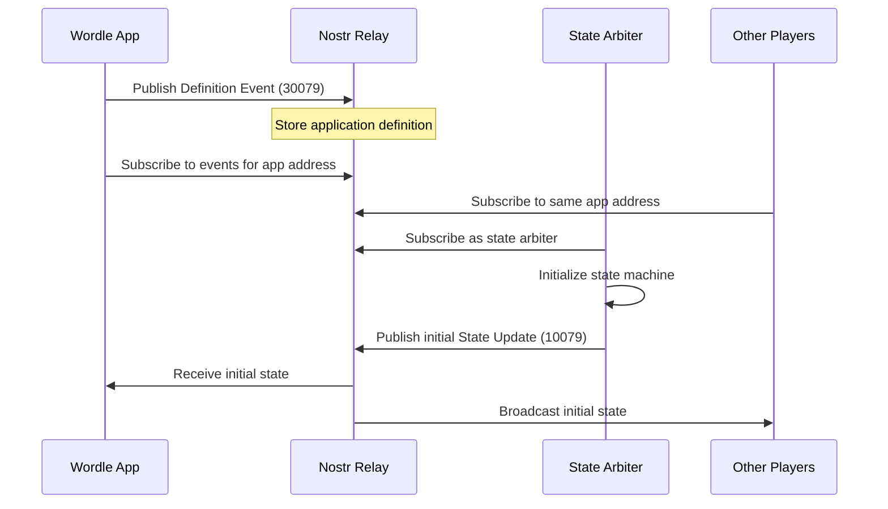
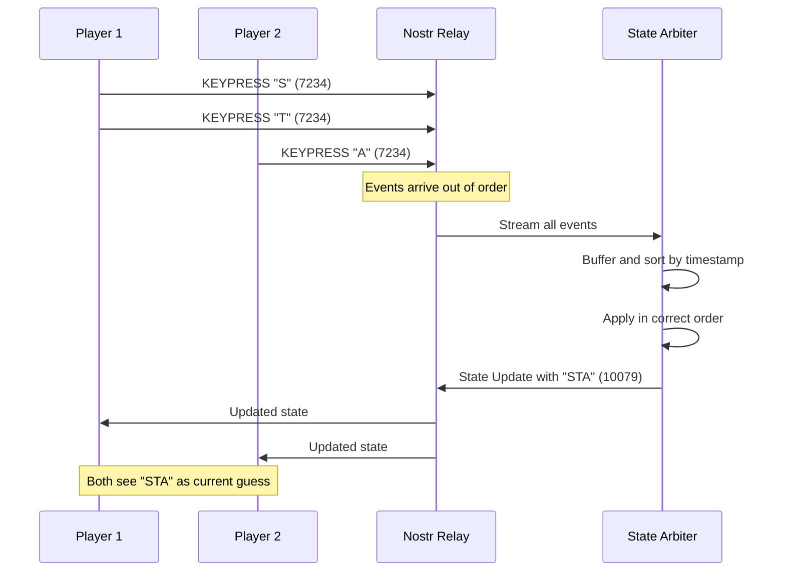
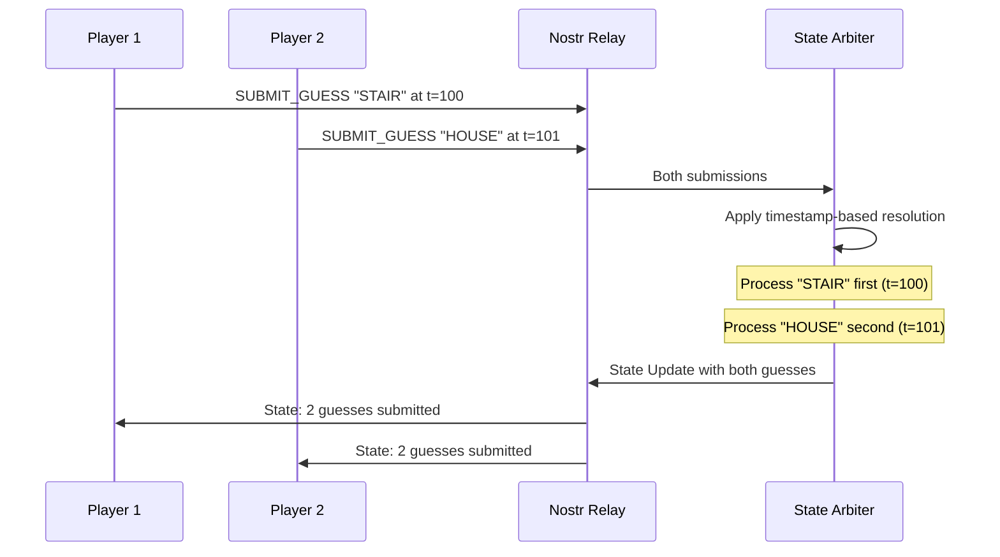

# NSM Protocol: Wordle Implementation Example

This document demonstrates the practical implementation of the NSM protocol through a real-world example: a collaborative Wordle game.

## Overview

The Wordle game serves as an excellent example of NSM protocol implementation because it:
- Has clear state transitions (letter input, word submission, game completion)
- Benefits from real-time synchronization (collaborative solving)
- Requires conflict resolution (multiple users guessing simultaneously)
- Demonstrates all three NSM event kinds in action

## Event Implementation Examples

### 1. Definition Event (Kind 30079)

The Wordle game definition establishes the game rules, state structure, and valid interactions:

```json
{
  "id": "8f3d2c1b9a7e6d5c4b3a2918f7e6d5c4b3a29187f6e5d4c3b2a19087f6e5d4c3",
  "pubkey": "a1b2c3d4e5f6789012345678901234567890123456789012345678901234567890",
  "created_at": 1707340800,
  "kind": 30079,
  "tags": [
    ["d", "wordle-collaborative-v1"],
    ["name", "Collaborative Wordle"],
    ["engine", "xstate"],
    ["engineCodeURI", "https://cdn.soveng.dev/nsm/wordle-machine.js"],
    ["ui-spec", "https://cdn.soveng.dev/nsm/wordle-ui.json"],
    ["version", "1.0.0"],
    ["description", "Real-time collaborative Wordle game with NSM synchronization"]
  ],
  "content": "{\"initialState\":{\"gameState\":\"playing\",\"currentGuess\":\"\",\"guesses\":[],\"letterStatuses\":{},\"targetWord\":null,\"gameId\":null,\"players\":[]},\"stateSchema\":{\"type\":\"object\",\"properties\":{\"gameState\":{\"type\":\"string\",\"enum\":[\"playing\",\"won\",\"lost\"]},\"currentGuess\":{\"type\":\"string\",\"maxLength\":5},\"guesses\":{\"type\":\"array\",\"items\":{\"type\":\"object\",\"properties\":{\"word\":{\"type\":\"string\",\"pattern\":\"^[A-Z]{5}$\"},\"result\":{\"type\":\"array\",\"items\":{\"type\":\"string\",\"enum\":[\"correct\",\"present\",\"absent\"]}},\"player\":{\"type\":\"string\"}},\"required\":[\"word\",\"result\",\"player\"]},\"maxItems\":6},\"letterStatuses\":{\"type\":\"object\",\"additionalProperties\":{\"type\":\"string\",\"enum\":[\"correct\",\"present\",\"absent\"]}},\"targetWord\":{\"type\":\"string\",\"pattern\":\"^[A-Z]{5}$\"},\"gameId\":{\"type\":\"string\"},\"players\":{\"type\":\"array\",\"items\":{\"type\":\"string\"}}},\"required\":[\"gameState\",\"currentGuess\",\"guesses\",\"letterStatuses\"]},\"interactionSchema\":{\"type\":\"object\",\"properties\":{\"type\":{\"type\":\"string\",\"enum\":[\"KEYPRESS\",\"BACKSPACE\",\"SUBMIT_GUESS\",\"RESET_GAME\",\"JOIN_GAME\",\"LEAVE_GAME\"]},\"payload\":{\"type\":\"object\"}},\"required\":[\"type\"]}}",
  "sig": "3045022100a9b8c7d6e5f4a3b2c1d0e9f8a7b6c5d4e3f2a1b0c9d8e7f6a5b4c3d2e1f0a9b8022079685746352413029180796857463524130291807968574635241302918079685746"
}
```

#### Key Components Explained

**State Schema for Wordle:**
- `gameState`: Current game phase (playing, won, lost)
- `currentGuess`: Letters being typed (max 5 characters)
- `guesses`: Array of submitted guesses with validation results
- `letterStatuses`: Keyboard color coding (correct, present, absent)
- `targetWord`: The word to be guessed (set by game initialization)
- `gameId`: Unique identifier for this game session
- `players`: List of participating player public keys

**Interaction Schema for Wordle:**
- `KEYPRESS`: Add a letter to current guess
- `BACKSPACE`: Remove last letter from current guess
- `SUBMIT_GUESS`: Submit complete 5-letter word
- `RESET_GAME`: Start new game with new word
- `JOIN_GAME`: Player joins collaborative session
- `LEAVE_GAME`: Player leaves session

### 2. Interaction Events (Kind 7234)

Wordle uses kind 7234 (deterministically calculated from app address).

#### Example: Letter Input

```json
{
  "id": "2b4c6e8a1c3e5f7a9b1d3f5e7a9c1e3f5b7d9f1e3a5c7e9b1f3d5a7c9e1b3f5d7a",
  "pubkey": "b2c3d4e5f6789012345678901234567890123456789012345678901234567890ab",
  "created_at": 1707340850,
  "kind": 7234,
  "tags": [
    ["a", "30079:a1b2c3d4e5f6789012345678901234567890123456789012345678901234567890:wordle-collaborative-v1"],
    ["p", "a1b2c3d4e5f6789012345678901234567890123456789012345678901234567890"]
  ],
  "content": "{\"type\":\"KEYPRESS\",\"payload\":{\"letter\":\"S\"},\"metadata\":{\"timestamp\":1707340850000,\"sessionId\":\"game-2024-02-07\",\"clientVersion\":\"1.0.0\"}}",
  "sig": "304502210089abcdef123456789abcdef123456789abcdef123456789abcdef123456789ab0220123456789abcdef123456789abcdef123456789abcdef123456789abcdef12345"
}
```

#### Example: Word Submission

```json
{
  "id": "7f8e9d0c1b2a3f4e5d6c7b8a9f0e1d2c3b4a5f6e7d8c9b0a1f2e3d4c5b6a7f8e9d",
  "pubkey": "b2c3d4e5f6789012345678901234567890123456789012345678901234567890ab",
  "created_at": 1707340855,
  "kind": 7234,
  "tags": [
    ["a", "30079:a1b2c3d4e5f6789012345678901234567890123456789012345678901234567890:wordle-collaborative-v1"],
    ["p", "a1b2c3d4e5f6789012345678901234567890123456789012345678901234567890"]
  ],
  "content": "{\"type\":\"SUBMIT_GUESS\",\"payload\":{\"word\":\"STAIR\"},\"metadata\":{\"timestamp\":1707340855000,\"sessionId\":\"game-2024-02-07\",\"clientVersion\":\"1.0.0\",\"guessNumber\":1}}",
  "sig": "3044022056789abcdef123456789abcdef123456789abcdef123456789abcdef1234567890220abcdef123456789abcdef123456789abcdef123456789abcdef123456789abcde"
}
```

### 3. State Update Event (Kind 10079)

After processing interactions, the arbiter publishes the canonical state:

```json
{
  "id": "4d5e6f7a8b9c0d1e2f3a4b5c6d7e8f9a0b1c2d3e4f5a6b7c8d9e0f1a2b3c4d5e6f",
  "pubkey": "c3d4e5f6789012345678901234567890123456789012345678901234567890abcd",
  "created_at": 1707340856,
  "kind": 10079,
  "tags": [
    ["a", "30079:a1b2c3d4e5f6789012345678901234567890123456789012345678901234567890:wordle-collaborative-v1"],
    ["p", "b2c3d4e5f6789012345678901234567890123456789012345678901234567890ab"],
    ["arbiter", "c3d4e5f6789012345678901234567890123456789012345678901234567890abcd"]
  ],
  "content": "{\"state\":{\"gameState\":\"playing\",\"currentGuess\":\"\",\"guesses\":[{\"word\":\"STAIR\",\"result\":[\"absent\",\"absent\",\"present\",\"absent\",\"correct\"],\"player\":\"b2c3d4e5f6789012345678901234567890123456789012345678901234567890ab\"}],\"letterStatuses\":{\"S\":\"absent\",\"T\":\"absent\",\"A\":\"present\",\"I\":\"absent\",\"R\":\"correct\"},\"targetWord\":\"CLEAR\",\"gameId\":\"2024-02-07-42\",\"players\":[\"b2c3d4e5f6789012345678901234567890123456789012345678901234567890ab\"]},\"metadata\":{\"stateVersion\":2,\"lastInteractionId\":\"7f8e9d0c1b2a3f4e5d6c7b8a9f0e1d2c3b4a5f6e7d8c9b0a1f2e3d4c5b6a7f8e9d\",\"timestamp\":1707340856000,\"conflictResolution\":\"timestamp-based\",\"arbiter\":\"c3d4e5f6789012345678901234567890123456789012345678901234567890abcd\",\"appliedInteractions\":[\"2b4c6e8a1c3e5f7a9b1d3f5e7a9c1e3f5b7d9f1e3a5c7e9b1f3d5a7c9e1b3f5d7a\",\"7f8e9d0c1b2a3f4e5d6c7b8a9f0e1d2c3b4a5f6e7d8c9b0a1f2e3d4c5b6a7f8e9d\"]}}",
  "sig": "3045022100bcdef123456789abcdef123456789abcdef123456789abcdef123456789abcdef02201234567890abcdef1234567890abcdef1234567890abcdef1234567890abcdef1"
}
```

## Interaction Patterns

### 1. Game Initialization Flow



### 2. Collaborative Guess Flow



### 3. Conflict Resolution Example

When multiple players submit guesses simultaneously:



## Implementation Details

### Word Selection Algorithm

The Wordle implementation uses a deterministic word selection based on game ID:

```javascript
function selectWordForGame(gameId, wordList) {
  // Use djb2 hash for deterministic selection
  const hash = djb2Hash(gameId);
  const index = Math.abs(hash) % wordList.length;
  return wordList[index];
}

function djb2Hash(str) {
  let hash = 5381;
  for (let i = 0; i < str.length; i++) {
    hash = ((hash << 5) - hash + str.charCodeAt(i)) & 0xffffffff;
  }
  return hash;
}
```

### Guess Validation

```javascript
function validateGuess(word, wordList) {
  // Must be exactly 5 uppercase letters
  if (!/^[A-Z]{5}$/.test(word)) {
    return { valid: false, reason: "Invalid format" };
  }

  // Must be in the word list
  if (!wordList.includes(word)) {
    return { valid: false, reason: "Not in word list" };
  }

  return { valid: true };
}
```

### Result Calculation

```javascript
function calculateResult(guess, target) {
  const result = [];
  const targetChars = target.split('');
  const guessChars = guess.split('');

  // First pass: mark correct positions
  for (let i = 0; i < 5; i++) {
    if (guessChars[i] === targetChars[i]) {
      result[i] = 'correct';
      targetChars[i] = null; // Mark as used
    }
  }

  // Second pass: mark present letters
  for (let i = 0; i < 5; i++) {
    if (result[i]) continue;

    const charIndex = targetChars.indexOf(guessChars[i]);
    if (charIndex !== -1) {
      result[i] = 'present';
      targetChars[charIndex] = null; // Mark as used
    } else {
      result[i] = 'absent';
    }
  }

  return result;
}
```

## Security Considerations

### 1. Word List Integrity

The word list is bundled with the application to ensure:
- Consistent gameplay across all participants
- No external dependencies that could be compromised
- Deterministic word selection

### 2. Player Authentication

All interactions are cryptographically signed:
- Players cannot impersonate others
- Game history is immutable and auditable
- Cheating attempts are detectable

### 3. State Validation

The arbiter validates all state transitions:
- Invalid guesses are rejected
- Game rules are enforced consistently
- State corruption is prevented

## Performance Optimizations

### 1. Event Batching

Group multiple letter inputs:

```javascript
const letterBuffer = [];
const BATCH_DELAY = 100; // milliseconds

function handleKeypress(letter) {
  letterBuffer.push(letter);

  clearTimeout(batchTimer);
  batchTimer = setTimeout(() => {
    if (letterBuffer.length > 0) {
      publishBatchedLetters(letterBuffer);
      letterBuffer.length = 0;
    }
  }, BATCH_DELAY);
}
```

### 2. State Diff Publishing

Only publish changed properties:

```javascript
function createStateDiff(oldState, newState) {
  const diff = {};

  for (const key in newState) {
    if (JSON.stringify(oldState[key]) !== JSON.stringify(newState[key])) {
      diff[key] = newState[key];
    }
  }

  return diff;
}
```

### 3. Subscription Filtering

Optimize relay subscriptions:

```json
{
  "kinds": [7234, 10079],
  "#a": ["30079:pubkey:wordle-collaborative-v1"],
  "since": 1707340800,
  "limit": 100
}
```

## Testing Strategies

### 1. Unit Tests

Test individual components:

```javascript
describe('Wordle State Machine', () => {
  it('should validate 5-letter words', () => {
    expect(validateGuess('STAIR', wordList)).toBe(true);
    expect(validateGuess('STAR', wordList)).toBe(false);
    expect(validateGuess('12345', wordList)).toBe(false);
  });

  it('should calculate correct results', () => {
    const result = calculateResult('STAIR', 'CLEAR');
    expect(result).toEqual(['absent', 'absent', 'present', 'absent', 'correct']);
  });
});
```

### 2. Integration Tests

Test NSM event flow:

```javascript
describe('NSM Integration', () => {
  it('should process interaction events', async () => {
    const interaction = createInteractionEvent('SUBMIT_GUESS', { word: 'STAIR' });
    await relay.publish(interaction);

    const stateUpdate = await waitForStateUpdate();
    expect(stateUpdate.content.state.guesses).toHaveLength(1);
  });
});
```

### 3. End-to-End Tests

Test complete game scenarios:

```javascript
describe('Complete Game Flow', () => {
  it('should handle winning scenario', async () => {
    const game = await initializeGame();
    await submitGuess('WRONG');
    await submitGuess('CLEAR'); // Correct answer

    const finalState = await getState();
    expect(finalState.gameState).toBe('won');
  });
});
```

## Deployment Considerations

### 1. Relay Configuration

Choose relays optimized for:
- Low latency (< 100ms round trip)
- High availability (99.9% uptime)
- Geographic distribution
- WebSocket support

### 2. Arbiter Deployment

Deploy arbiters with:
- Redundancy (multiple arbiters)
- Consistent conflict resolution
- State backup mechanisms
- Monitoring and alerting

### 3. Client Optimization

Optimize clients for:
- Offline capability (local state cache)
- Optimistic updates (immediate UI feedback)
- Reconnection handling
- State synchronization on recovery

## Conclusion

The Wordle implementation demonstrates how NSM protocol enables:
- **Real-time collaboration** without central servers
- **Deterministic gameplay** across distributed participants
- **Conflict resolution** for simultaneous actions
- **Cryptographic integrity** of game state
- **Scalability** through Nostr relay network

This example can be adapted for other turn-based games, collaborative applications, and real-time systems requiring distributed state synchronization.